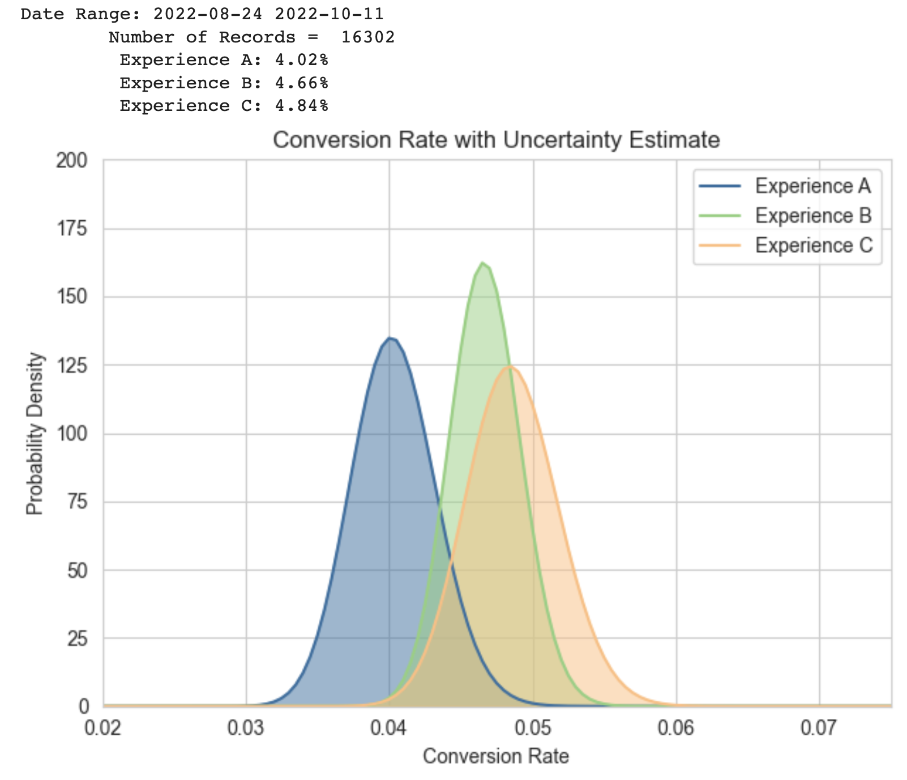

## AB Testing with Bayesian Posteriors

View code used to generate Bayesian confidence intervals [here.](https://github.com/jakehanson/jakehanson.github.io/blob/master/Portfolio/AB%20Testing%20With%20Bayesian%20Posteriors/Bayesian%20Confidence%20Intervals%20-%20Portfolio.ipynb)

View theoretical description [here.](https://github.com/jakehanson/jakehanson.github.io/blob/master/Portfolio/AB%20Testing%20With%20Bayesian%20Posteriors/bayesian_inference_in_AB_testing.pdf)

*Example of Bayesian posteriors in practice. Rather than reporting a single conversion rate, we report the conversion with estimated uncertainty. This allows us to easily determine whether or not differences in conversion are significant.*

