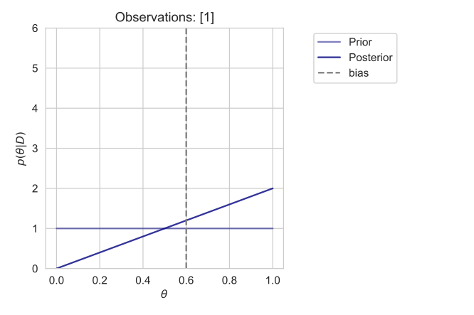
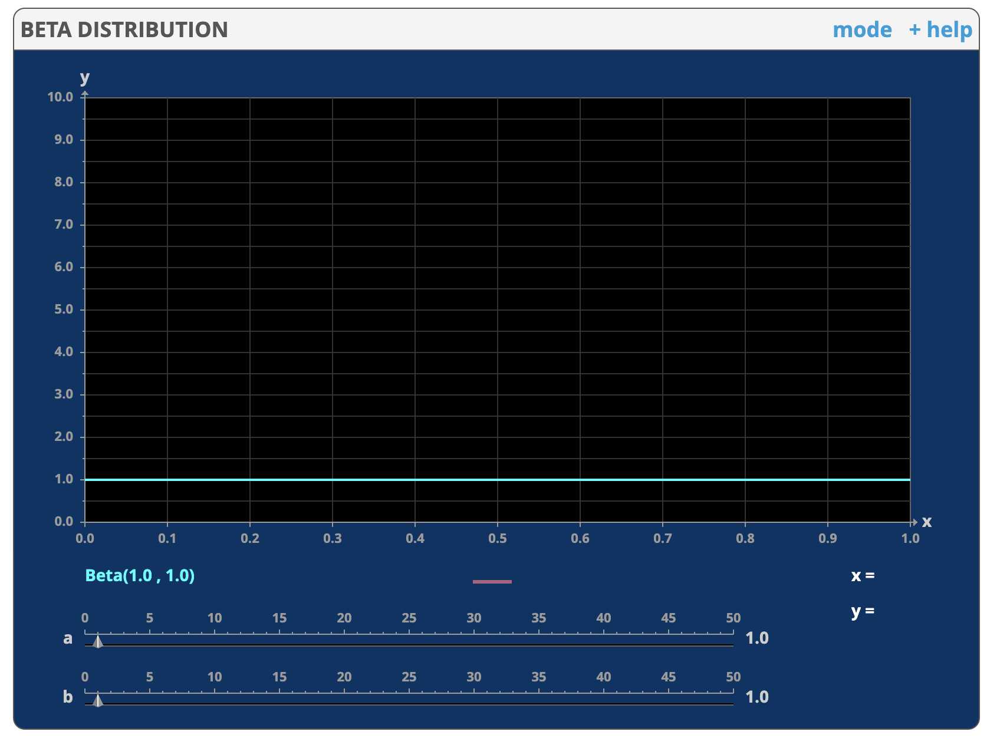
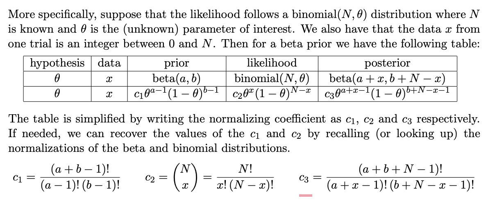
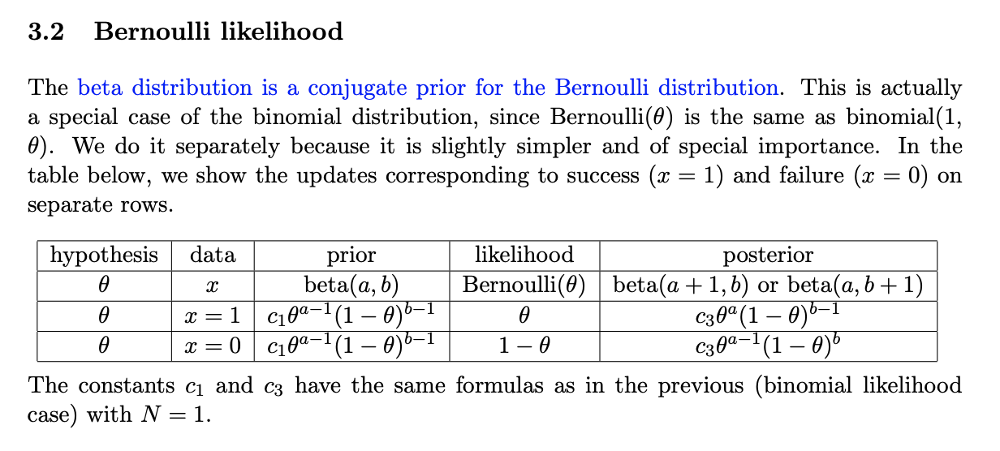

## Bayesian Inference in AB Testing

Each experience within an AB test can be considered a binomial process. You have $n$ trials with $k$ successes, and it is assumed that the probability of success $\theta$ is the same for each trial. Therefore, the probability mass function is as follows:
$$
p(n,k) = {n \choose{k}}\theta^k(1-\theta)^{n-k}
$$
In AB testing, the goal is to conclude whether the success rate is higher for experience A or experience B. This means that we need to compare the parameters $\theta_A$ and $\theta_B$ to one another. Of course, we don't know the true value of a binomial process based on a finite set of observations. Instead, we must estimate it.

### Maximum likelihood estimation

The naive approach to AB testing is to just compare the observed conversion rates to one another, without bothering to understand the certainty in this process. As it turns out, assuming $theta = n/k$ is the same as calculating the maximum likelihood estimate for each process. The maximum likelihood estimate (MLE) is the value for $\theta$ with the highest probability of being the true underlying value; however, we again would like to emphasize that it's not the only value $\theta$ that is consistent with the observations.

To calculate the MLE we can see which value of theta maximizes $p(n,k)$. We know what $n$ and $k$ are, so this simply amounts to a derivative with respect to $\theta$:
$$
\frac{dp}{d\theta} = C [k\theta^{k-1}(1-\theta)^{n-k} - (n-k)\theta^k(1-\theta)^{n-k-1}]
$$
Setting the derivative equal to zero and solving for theta yields:
$$
\hat{\theta} = n/k
$$
Thus, we see that the maximum likelihood estimate for $\theta$ is the same as the average number of successes in our observed data. For small values of $n$ and $k$, this estimate will fluctuate drastically, which suggests the MLE is not the entire story.

### Bayesian Inference

What we would really like to know is the probability that a given $\theta$ generated our observations. The problem is that there are infinitely many values of $\theta$ that are consistent with our observations. What we must do then, is quantify the likelihood that a given $\theta$ generated our data and compare these likelihoods to one another. As we saw in the previous section, the $\theta$ value with the maximum likelihood is $\hat{\theta} = n/k$, but how does this compare to other values?

To solve this problem, we must invert the PMF for our Binomial process using Bayes Theorem, which states:
$$
P(\theta|D) = \frac{P(D|\theta)p(\theta)}{P(D)}
$$
We are already familiar with the likelihood function $P(D|$\theta)$ which is just the PMF $p(n,k)$ parameterized with the value $\theta$. The other two terms $p(\theta)$ and $P(D)$ are known as *priors* and quantify the underlying probability of any given $\theta$ and set of observations $D$. Readers familiar with probability theory may interpret $p(\theta)$ as weighting the likelihood functions in a way that is similar to calculating expectation values, which it essentially is. In this view, $P(D)$ can be thought of as a normalization constant ensuring that probability sums to unity.

#### Continuous Priors, Discrete Likelihood

Since $\theta$ is a continuous parameter, $p(\theta$ is a probability *density* function rather than a probability *mass* function. This means that the probability of $\theta$ taking a given value must be specified as $\theta$ in a range of values between $\theta$ and $\theta + d\theta$. Since $p(theta)$ is continuous, our posterior $P(\theta|D)$ is also continuous. Yet, the likelihood function is discrete; for any given value of $\theta$ we can plug it into the likelihood function and get out a real value. To differentiate probability mass functions from probability density functions we will use $f(x)$ for probability density and $p(x)$ for probability mass.

We also know that the prior $P(D)$ is not a function of $\theta$ and since the probability density must integrate to unity, we can absorb this into a constant to be calculated later:
$$
f(\theta|D) \propto  P(D|\theta)f(\theta)
$$
which can also be stated:
$$
\textrm{posterior} \propto \textrm{likelihood}\times \textrm{prior}
$$
The full expression of Bayes Theorem for continuous priors and a discrete likelihood is:
$$
f(\theta|x)d\theta = \frac{p(x|\theta)f(\theta)d\theta}{\int_{\theta} p(x|\theta)f(\theta)d\theta}
$$

#### Choosing a Prior

The best choice of prior is thta of maximum ignorance. For a Binomial process, we know the parameter $\theta$ is bounded in [0,1], so maximum ignorance is the uniform distribution over this support (flat prior). For unbounded parameter support, such as that of Gaussian random variables,  a flat prior won't converge, and a normal distribution is instead the correct prior. In both cases, the prior corresponding to maximum ignorance can be derived from the principle of maximum entropy.

A uniform prior over the support [a,b] takes the form:
$$
f(\theta) = \frac{1}{b-a}
$$
Such that the integral $\int_a^b f(\theta) d\theta = 1$. For AB testing, we have the support [0,1] so $f(\theta) = 1$:
$$
P(\theta|D) \propto P(D|\theta) f(\theta) \propto P(D|\theta)
$$
We know the likelihood distribution $P(D|\theta)$ so all that left to do is determine the constant of integration. To do this, we have the normalization condition:
$$
\int_{\theta} P(\theta|D) d \theta = \int_{\theta} c_1 P(D|\theta) d \theta = 1
$$
As we will show later on, this results in a normalization constant:
$$
c_1 = (n+1){n \choose k}
$$

### Bayesian Update

The process of calculating the posterior is one of updating beliefs. We begin with the prior expectation for what the likelihood of $\theta$ is given maximum ignorance. Then, after observing some data we have a new pdf (the posterior) representing our updated belief. This new pdf can then serve as the prior for more data, meaning that as data comes in we continuously update our prior using the previous posterior.

For example, let's say we have a biased coin with a probability $\theta$ of Heads. We will assume that the true underlying parameter is $\theta = 0.6$ and our goal is to estimate this parameter using observations.

Before we observe any data, we have a flat prior meaning $f(\theta)$ is a uniform distribution over all possible $\theta$ values. Then, if the first observation is $x_1 = 1$ we have::
$$
f(\theta|x_1 = H) \propto p(x_1=H|\theta)f(\theta) = c_1\theta
$$
with normalization constant $c_1 = \frac{1}{\int_{\theta} f(\theta|x_1=H)} = 2$. So our posterior is:
$$
f(\theta|x_1 = H) = 2\theta
$$
This process of calculating the posterior is shown below:

Now, let's say the next flip of the coin results in the outcome $x_2 = T$. There are actually two ways to proceed. We can either calculate the likelihood of the *sequence* of events [H,T] for a given parameter $\theta$ OR we can update our prior using our posterior and ask what the likelihood of a *single* Tails is.

Using the latter approach we have:
$$
f(\theta|x_2 = T) \propto p(x_2=T|\theta)f(\theta|x_1=T)
$$
Notice that our prior is no longer flat, but rather, it is the posterior we calculated after the first observation. The reason for this is that we are no longer maximally ignorant; instead, we have data to suggest that certain values of $\theta$ are more likely than others.  Continuing the calculation, we find:
$$
f(\theta|x_2 = T) = 6(\theta - \theta^2)
$$
This posterior is symmetric and centered around $\theta = 0.5$, which we would expect for the observations [H, T].

One of the main benefits of updating the prior using the posterior is that each observation is a single Bernoulli random variable instead of a Binomial random variable. This means that the likelihood function is either $\theta$ or $(1-\theta)$ depending on the outcome of the coin flip, instead of the more complicated function ${n \choose{k}}\theta^k(1-\theta)^{n-k}$. 

This process of iteratively updating our prior is shown graphically below. After 500 coin flips, we see that the posterior is tightly centered about the true underlying bias $\theta=0.6$.

### Beta Distributions

The beta distribution beta(a,b) is a two-parameter distribution taking a wide variety of qualitatively different shapes. The range of the distribution is [0,1] (with a and b taking positive real values) which makes it well-suited for a pdf. Indeed, if a pdf has the form:
$$
f(\theta) = c \theta^{a-1}(1-\theta)^{b-1}
$$
then $f(\theta)$ is beta(a,b) and the normalization constant is:
$$
c = \frac{(a+b-1)!}{(a-1)!(b-1)!}
$$
The importance of the beta distribution for AB testing is that it is the *conjugate prior* of a binomial process. What this means is that if our prior is a beta distribution and our likelihood function is a binomial pmf then the resulting posterior is also a beta distribution. The utility of this is best demonstrated with an example.

Let's return to our bias coin with $\theta = 0.6$ and the observation sequence $x = [H,T,...]$. We have already discussed that the best choice for our initial prior is the uniform distribution, which is actually the same as beta(1,1):

 

The fact that the uniform distribution is a special case of the beta distribution is extremely important, as it means the posterior takes the form:
$$
\textrm{posterior} \propto \textrm{Binomial}\times \textrm{beta(1,1)}
$$
As mentioned, this guarantees that the posterior will also be a beta distribution but to see that this is the case we can calculate it directly. We just did this calculation in the previous section and we know the result is:
$$
f(\theta|x_1 = H) = 2\theta = \textrm{beta}(2,1)
$$
We can double check that the normalization constant $c = 2$ is indeed the same as $c = \frac{(a+b-1)!}{(a-1)!(b-1)!}$ with $a=2$ and $b=1$. 

In general, given a Binomial process with $n$ successes and $m$ failures, if we assume a flat prior then the posterior is simply:
$$
\textrm{beta}(n+1,m+1)
$$
It is hard to express how useful this is without having done more examples, but basically, you are able to calculate the posterior simply by plugging in $n$ and $m$. There is no need to update your prior or calculate an integration constant. You can essentially calculate your posterior without calculating anything regarding your priors or likelihood function. All you need to know is that it's a binomial process with a flat prior. If your prior is not flat, and instead has $a-1$ successes and $b-1$ failures, then your posterior is as follows:

### Conjugate Priors

The previous section demonstrated the utility of conjugate priors in easily calculating posteriors for a Binomial process. Rather than iteratively updating your prior with each individual observation or calculating your posterior explicitly using the binomial pmf, you can simply plug in the number of successes and failures to the beta distribution and that is the result.

Processes other than binomial random variables also have conjugate priors. For example, if your prior distribution is normal and your likelihood function is normal then your posterior will be normal as well. Thus, the normal distribution is the conjugate prior of a normal likelihood function.

A full list of conjugate priors can be found [here](https://en.wikipedia.org/wiki/Conjugate_prior). The following are summaries of common distributions from [these MIT lecture notes](https://ocw.mit.edu/courses/18-05-introduction-to-probability-and-statistics-spring-2014/f5cffb9eb5ca110cd92133292fc2a5a6_MIT18_05S14_Reading15a.pdf):

#### Normal

#### Binomial

#### Bernoulli

The Bernoulli distribution is just a special case of the binomial distribution with N=1:

#### Geometric

### Summary

In these notes, we have covered how to use Bayesian inference to constrain the results of AB testing. The main goal of AB testing is to determine the success rate $\theta$ given our observations. The observations themselves are in the form of a binomial random variable with $n$ successes and $m$ failures. If we assume maximum ignorance as our prior, then our posterior distribution is just:
$$
\textrm{beta}(n+1,m+1)
$$
We can always calculate this starting from a uniform prior, or we can update our posterior using the previous prior and the number of successes/failures since the last update. In this case, the posterior looks like:
$$
\textrm{beta}(a+m,b+n)
$$
where the initial number of successes and failure were $a-1$ and $b-1$ and the subsequent number of successes and failures are $m$ and $n$. We have been a little sloppy with notation, so if you ever get confused about the specific value of a, b, n, or m, you should return to the definition of the beta distribution:
$$
\textrm{beta(a,b)} = f(\theta) = c \theta^{a-1}(1-\theta)^{b-1}
$$
with:
$$
c = \frac{(a+b-1)!}{(a-1)!(b-1)!}
$$
Using this, one should be able to estimate the uncertainty in AB test results and, ultimately, determine if there are significant differences between experiences.