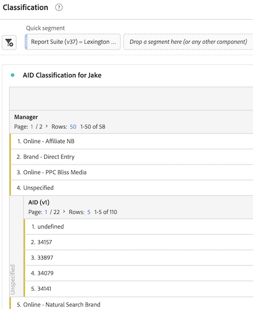
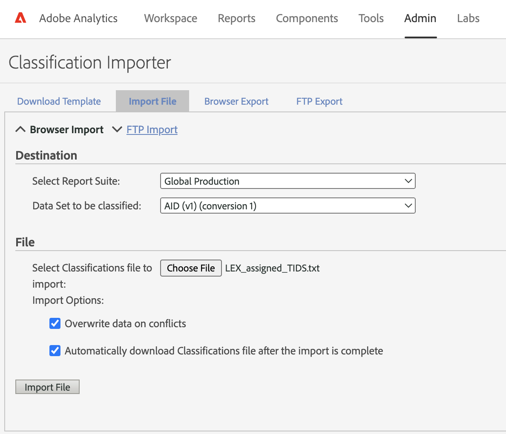
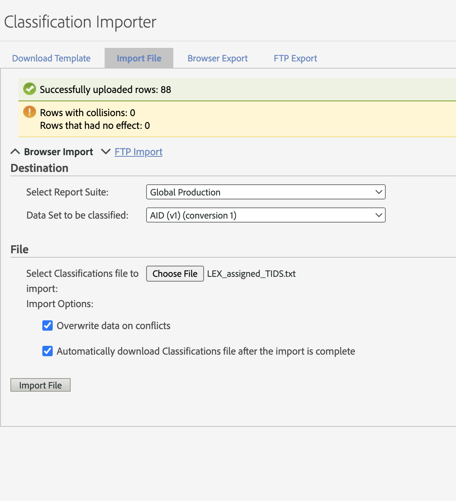

## Adobe TID Classification
The goal is to assign the unassigned marketing campaigns (TIDs) from Adobe Analytics to their corresponding Managers for both Lex and CR. To do this, we need to use the map from `TID` to `Manager` found in the marketing databases. 

The SQL programs used to query the databases are `Adobe Classification Query (CR).sql` and `Adobe Classification Query (Lex).sql`. The output from these queries is stored in the CSV files `CR TID Map.csv` and `Lex TID Map.csv`. In what follows, we read these results in and use them to assign the unknown TIDs to a Manager. We then store the classified TIDs as a template and upload them into Adobe Analytics.


```python
## Import packages
import pandas as pd
import numpy as np
import matplotlib.pyplot as plt
import seaborn as sns
sns.set_style('darkgrid')
```

## Step 1 - Download the unassigned TIDs from Adobe Analytics

- Log in to Adobe Analytics
- Select AID Classification from the Workspace
- Drag AID v1 onto Unspecified
- Add the brand at the top as a segment (Lexington Law or Credit Repair) by searching components for `Report Suite (v37)` and selecting either `Lexington Law` or `Credit Repair`
- Expand the Unspecified AID column:



- Download CSV for each brand
    - Project -> Download CSV (for each brand)
    

## Step 2 - Generate the map between TID and Department using SQL

#### Here is the SQL query for CR:

```sql
REDACTED
```

#### And here is the SQL query for Lex:

```sql
REDACTED
```

## Step 3 - Assign the TIDs to a Manager


```python
## Read in unassigned TIDs for LEX and CR
CR_unassigned_TIDs = pd.read_csv('unassigned_TIDs/Batch 2 - Unassigned TIDs - Credit Repair.csv')
LEX_unassigned_TIDs = pd.read_csv('unassigned_TIDs/Batch 3 - Unassigned TIDs - Lex.csv')

## Convert these DataFrames to lists
CR_unassigned_TIDs = CR_unassigned_TIDs['AID (v1)'].tolist()
LEX_unassigned_TIDs = LEX_unassigned_TIDs['AID (v1)'].tolist()

## Read in the tbl_campaigns map generated by the SQL query (e.g., TID and Manager) 
CR_SQL_results = pd.read_csv('CR TID Map.csv')
LEX_SQL_results = pd.read_csv('LEX TID Map.csv')

## Assign missing TIDs to a manager using the SQL results
CR_assigned_TIDs = CR_SQL_results.loc[CR_SQL_results['Key'].isin(CR_unassigned_TIDs)]
LEX_assigned_TIDs = LEX_SQL_results.loc[LEX_SQL_results['Key'].isin(LEX_unassigned_TIDs)]

## Add a warning if unassigned TIDs aren't assigned
for TID in LEX_unassigned_TIDs:
    if TID not in LEX_assigned_TIDs['Key'].to_list():
        print("\033[1;31;47m WARNING: TID ",TID,"NOT ASSIGNED  \n")
        
LEX_assigned_TIDs
```

<table border="1" class="dataframe">
  <thead>
    <tr style="text-align: right;">
      <th></th>
      <th>Key</th>
      <th>Name</th>
      <th>Manager</th>
      <th>Department</th>
      <th>Brand</th>
      <th>Type</th>
      <th>Channel</th>
      <th>Network</th>
      <th>Delivery</th>
      <th>Device</th>
    </tr>
  </thead>
  <tbody>
    <tr>
      <th>8787</th>
      <td>33795</td>
      <td>LEX ECF Email 4</td>
      <td>Remarketing - ECF Email</td>
      <td>Other</td>
      <td>LexingtonLaw</td>
      <td>Other</td>
      <td>Other</td>
      <td>Other</td>
      <td>NaN</td>
      <td>NaN</td>
    </tr>
    <tr>
      <th>8992</th>
      <td>34000</td>
      <td>Aktify Drive to Web</td>
      <td>Remarketing - FOG SMS</td>
      <td>Remarketing</td>
      <td>LexingtonLaw</td>
      <td>Other</td>
      <td>Other</td>
      <td>Other</td>
      <td>NaN</td>
      <td>NaN</td>
    </tr>
    <tr>
      <th>9090</th>
      <td>34098</td>
      <td>LEX General | TKW - Credit Score - Check Score...</td>
      <td>Online - PPC Search Other</td>
      <td>Paid Media</td>
      <td>LexingtonLaw</td>
      <td>Other</td>
      <td>Search</td>
      <td>Other</td>
      <td>NaN</td>
      <td>NaN</td>
    </tr>
    <tr>
      <th>9103</th>
      <td>34111</td>
      <td>Consumer Affairs - Review</td>
      <td>Online - Affiliate NB</td>
      <td>Online - Affiliate NB</td>
      <td>LexingtonLaw</td>
      <td>Other</td>
      <td>Other</td>
      <td>Other</td>
      <td>NaN</td>
      <td>NaN</td>
    </tr>
  </tbody>
</table>
## Step 4 - Output Results as Tab-Deliminated Text File


```python
## First read in an old template to get the header syntax
temp_file = open("old_template.txt")
number_of_lines = 4
headertext = ""
for i in range(number_of_lines):
    headertext += temp_file.readline()
headertext = headertext.rstrip() ## remove the last newline character (formatting

## Now export the assigned TIDs as formatted templates
np.savetxt('CR_assigned_TIDS.txt', CR_assigned_TIDs.values, fmt='%s', delimiter='\t', header=headertext, comments='')
np.savetxt('LEX_assigned_TIDS.txt', LEX_assigned_TIDs.values, fmt='%s', delimiter='\t', header=headertext, comments='')

print("Done")
```


## Step 5 - Upload to Adobe
Go to `Admin` then `Classification Importer`. Click `Import File` and select `AID (v1)` for data set to be classified.



#### A successful import should look something like this:



## Summary

To summarize, we began by reading in the unassigned marketing campaigns that we downloaded from Adobe Analytics (Step 1). We then used `redacted` in the marketing database to download the metadata for all TIDs (Step 2). Next, we used this metadata to map each unassigned campaign to a manager (Step 3). Last, we output the results to a specially formatted file (Step 4) and imported this file to Adobe Analytics (Step 5).
