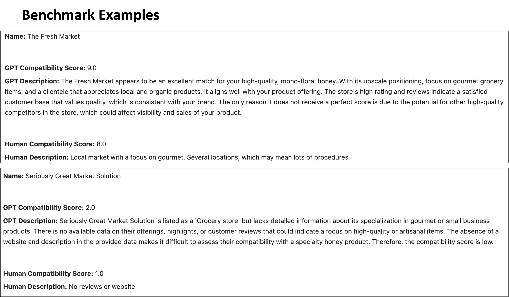
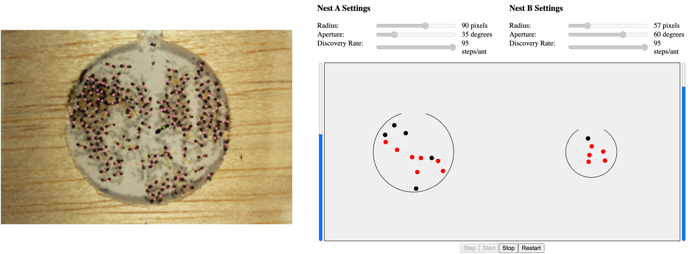
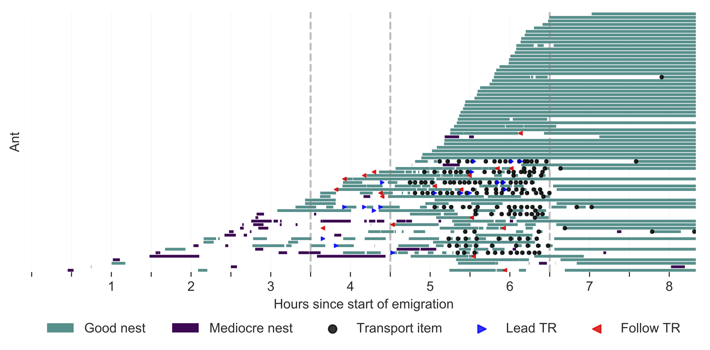
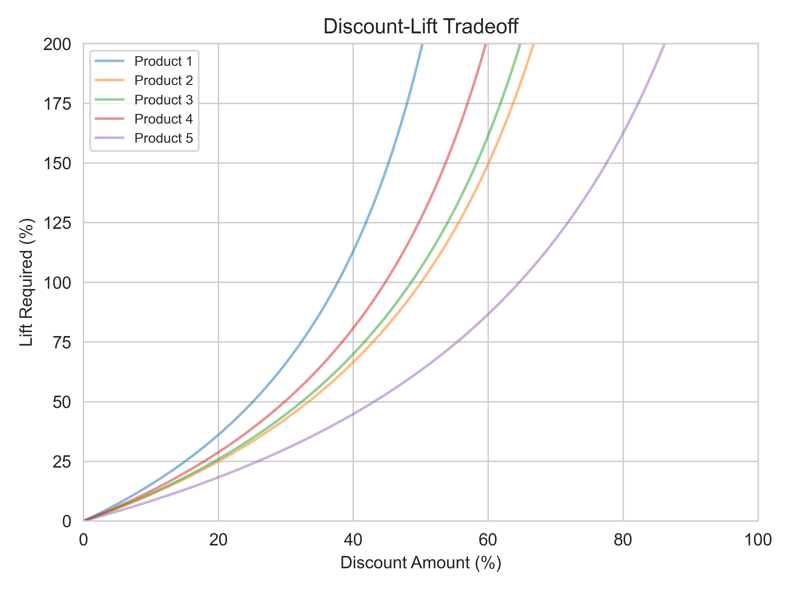
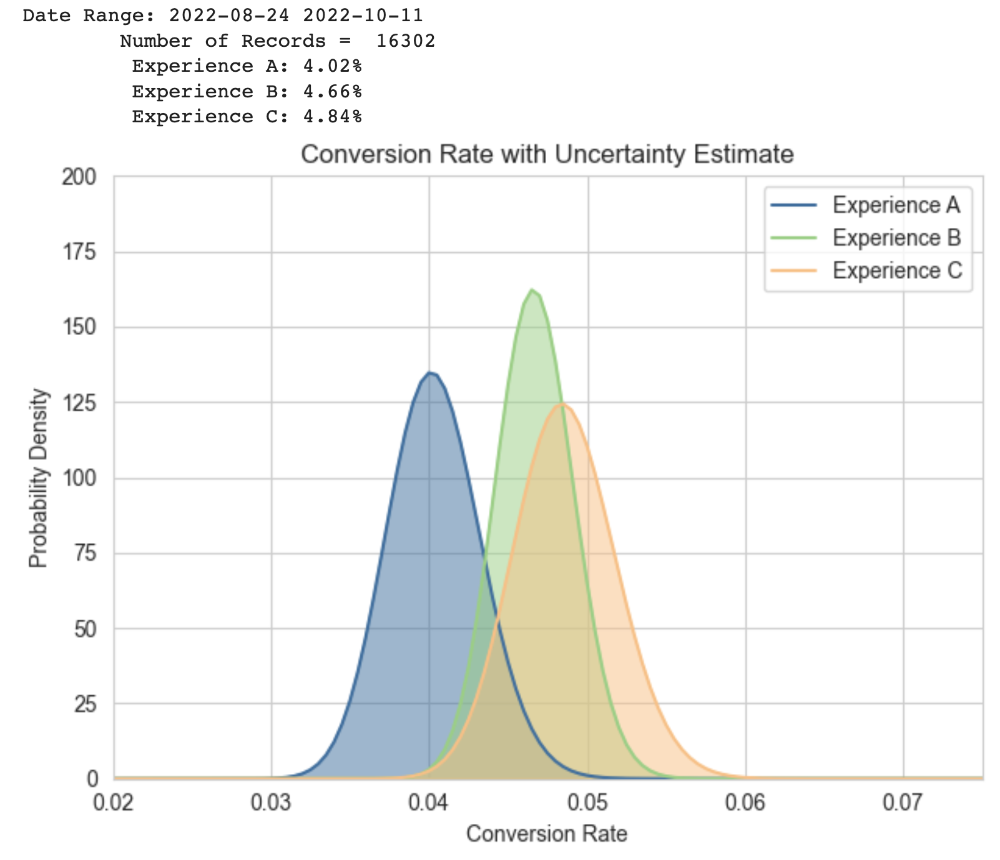
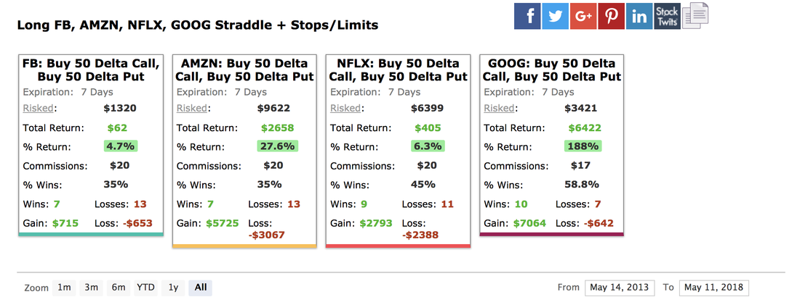
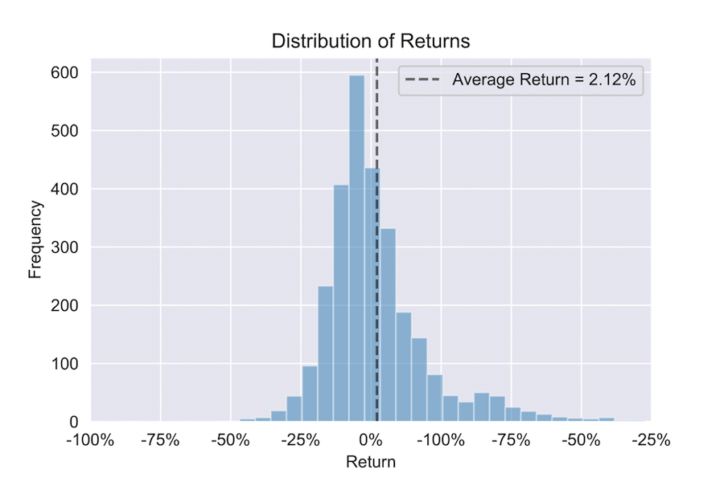
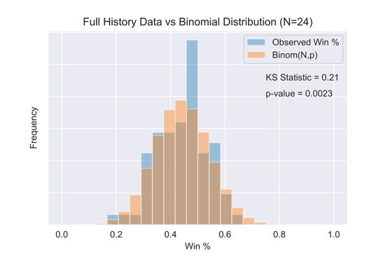

## Data Science Portfolio

This portfolio showcases a diverse collection of projects that demonstrate advanced proficiency in mathematics, programming, data science, data visualization, and communication. Each project employs a variety of programming languages and mathematical concepts to solve a real-world problem, demonstrating the ability to apply quantitative skills to various domains, ranging from marketing to astrophysics, and from finance to entomology. Moreover, each project highlights the importance of making insights accessible and engaging to a non-technical audience using clear and concise visualizations.

- [Web Scraping with GPT and AWS Deployment](#GPT)
- [Exoplanets and Image Processing](#KLIP)
- [Numerical Hydrodynamics in C++](#Haumea)
- [Agent Based Modeling with Javascript and HTML](#nest-site-selection-1)
- [Network Theory and Information Theory](#nest-site-selection-2)
- [Discount-Lift Tradeoffs](#discount-lift-tradeoff)
- [A/B Testing](#ab-testing-bayesian)
- [Quantitative Finance](#options-trading)
- [Adobe Analytics](#adobe-classification)

### Using GPT and Web Scraping to Build Market Contact Directories

      

This project uses Large Language Models (LLMs) and web-scraping APIs to create targeted contact directories connecting buyers and sellers. We demonstrate this with a Florida-based family-owned apiary looking to partner with gourmet grocery stores interested in their products. The [resulting contact directory](http://gourmetgrocerystorefinder.us-west-2.elasticbeanstalk.com/) includes store names, descriptions and compatibility scores generated by the LLM, as well as websites, addresses, phone numbers, and emails.

The algorithm iterates through local Google search results using the search query "Gourmet Grocery Stores". The results from this search are then used to query the Google Place API, which provides verification of local businesses and additional information including websites, ratings, reviews, and addresses. This detailed information from the Place API is then processed and cleaned before being fed into an LLM (GPT-4) for compatability analysis using a prompt designed to match the places under consideration with the artisan apiary .The prompt is benchmarked against human-evaluated data in order to ensure its effectiveness before being implemented across the entire dataset. The flowchart below illustrates this process.

The algorithm is devoloped in Python, rendered in HTML using Flask, and deployed  in a cloud environment using AWS Elastic Beanstalk.

[View Code on Github](https://github.com/jakehanson/GPT_Web_Scraping)

### Direct Imaging of Exoplanets with Karhunen-Loève Image Processing

   -green)

In this project, I use the Karhunen-Loève Transform (KLT) to directly image exoplanets. This algorithm is a generalization of principal component analysis that diagonalizes the covariance matrix of a set of reference images. The result is a set of uncorrelated variables called Karhunen-Loève basis functions that can be ordered based on their importance.

In Astronomy, these basis functions capture systematic defects in the telescope optics that result in a speckle pattern that is the same order of magnitude as astrophysical sources. By subtracting the basis functions, you can remove the systematic defects while retaining the astrophysical signal - enabling the discovery of faint exoplanets in bright environments.

*Overview of Karhunen-Loève Image Processing. Notice that the birthmark and eyes, being unique features of the target image, are not removed by subtraction of the basis functions. Image by author.*

*Very Large Telescope (VLT) images of the HR8799 stellar system processed using my implementation of the KLT algorithm. Multiple directly imaged exoplanets can clearly be seen in white.*

[View Publication](https://iopscience.iop.org/article/10.3847/0004-637X/820/1/40/meta)

[View Code on GitHub](https://github.com/jakehanson/KLIP)

### Modeling the Interior of the Dwarf Planet Haumea

   

Haumea is a dwarf planet located beyond Neptune's orbit. It is one of several dwarf planets that would have to be added to the nine recognized planets in our solar system if Pluto were to remain. Unlike other planets, Haumea is so small and distant that its angular width is less than a single pixel when imaged with a telescope. This means that its shape and density cannot be directly measured.

Instead, we must rely on self-consistent gravitational/hydrodynamic simulations to infer a shape and composition consistent with the planet's known mass and photometric observations. Here, we provide such a simulation, assuming a stable, 3D self-gravitating body in hydrostatic equilibrium with a differentiated ice crust. We find that Haumea's formation history likely included liquid water and the potential for habitability for a period of approximately 100 million years.

*Self-consistent 3D gravitational simulation of the dwarf planet Haumea.*

[View Project on Github](https://github.com/jakehanson/Haumea)

### Nest Site Selection in Temnothorax Ant Colonies (Part 1)

   

Nest site selection in ant colonies is a fascinating example of collective decision-making without centralized control. To better understand this process, we modeled the ant species *Temnothorax Rugatulus* as particles undergoing Brownian motion within the nest. By fine-tuning the parameters of the Brownian random walk, we were able to show that this simple model can be optimized for specific nest geometries based on the quorum density within the nest. When a quorum threshold is met, ants transition from slow nest exploration to rapid brood carrying, indicating the successful selection of a new nest site. Our study provides insight into the underlying mechanisms of ant collective decision-making and underscores the ability of natural selection to delegate critical aspects of a collective decision to the physical environment.

*Ant colony on the left with a screenshot of the agent-based simulation on the right.*

[View Web Simulation](https://elife-asu.github.io/wss-modules/modules/4-collective-behavior/)

[View Code on GitHub](https://github.com/jakehanson/wss-modules/tree/master/modules/4-collective-behavior)

[View Publication](https://link.springer.com/article/10.1007/s11721-021-00196-4)

### Nest Site Selection in Temnothorax Ant Colonies (Part 2)

![](https://img.shields.io/badge/Network_Theory-white?&logocolor=000080&logo=data:image/png;base64,iVBORw0KGgoAAAANSUhEUgAAAOEAAADhCAMAAAAJbSJIAAAAh1BMVEX29vYAAAD39/f6+vrz8/OYmJgxMTGqqqrw8PDExMQkJCQgICDx8fGtra3s7Oy+vr7l5eXZ2dnPz88YGBjJyck6OjoqKiqFhYWioqJra2uNjY3c3Ny5ublVVVVzc3NcXFxEREQRERGBgYFISEhhYWF4eHgTExNGRkY1NTVWVlaSkpKcnJxsbGwGrqo6AAASm0lEQVR4nO1diXKruBLFLTA4DhjwRgAveLnXifP/3/cAb1JLgACJSeZNV83UTGyLPmhp9aIjA/7tYoDx75b/EP5++Q/h75c2CH/Ou7hrki+UBEgpxZpZ9d2fo3dLAXD8RRpdLesauYvEq8DYug9/xgvJO4+Y6WEzno9KycbHb9fPu1Lw1R+icksBM7DGIyTzbejxaOQR3vYHP0IAkiuHr5C3w4LrRjmExXR+/sc/DhPIYpeJAOayTE2Cvi2BEMCfROfNMpfd2g6rpvRQAn5UAa+UbcCq14wwHxL2bkW9pa3r/JMYib+e1yEc7RJGuyaEQJzoiIZE9nEfCv8ETjDPVSP0IR8JPZNqEEL5z2InHAr+P7QGgxc34Ct6MaDmYn0fguHuxY2cFv9QD9rTZoSjrflSrh4hSSvbO4ak5oe6hIRLCYCjUfpSrg4hmG7NC1uFw3ciOBspgKPl4qYc1CMki9oXdvKHhggklQM4Gh2eu5u6lQY+axvJLHNgiOALlz2RvD0nUV0f1hrWXKYzMuhyA2aUcUqMPz+2u+Uf7u/bZoSQNI7507CLDfgfWIO/X5PE8/zQ5nSdP+ZQTR/a/IvBMuxMJOEKPX+XmGW4MN93xRn6zK1BePMD/VMjwNF6SIAGsdmnZ7H33LwQcBHEb++xnFZ0Awnrd3+lbJIhO5GgQfpNDyEAtNk5Jk0IXYRmvr1aeB6MFwMiBIIGKftwgtaN8aIJ4ZZt7hQUAZ+UtZB/Iu24XgI+6kLkqQK7cGQuqbf45Mj2YAjlt2127H4NaBIhZBG62NVFO7ro7rSLEYJB2K9v4b7+sENh7QyGEGDCPPoNb4zxfuBK7qGzqj68MF+37y/EPDN/PgyH0EAIx4wvXwwwj51YVm0fcgiv96873z8F4QpFK3KE7ELYEuGJlMOUJOz0HHCUYoRzbpQm7D762oQQbXLTYvdAsIc95OYbrzQRjbAYpZOx6PNqhGu2vUuUgBkc2J3c3B1w6w0eq9GGHT9gfrG6pU0IsSs23Ww/juhv48mQFh+QxZ8xBpEkf1ndFtBgDxOJeMGQTjBww2oZGq+wJnhoWm38hj0NeKxdEMrXINgewg2rXfjoRSA+jsE9lvka78lt3noP7D0FeFgtZ84tfUgW3xn6LG30DwX+JpbvgT1gZ82psInCIAjdb+6D8XuzB4zsDy/LycABRZgJMk7z1fhNoJwlEacB2Ap+SclWkK3TKnhHVSPjQCJOky+n9W7+1CYDp2ggaI6slJJdn1uR2ogwhNgAIohDB4WBSIRWCqHyTw25pwWO/bDyGQw6E3MHSiZrMWLc/waEJKlfUDeDQpRLy+SLT0QFchvzh4klWqmesh3SBXaFyXtOsjUToqqdh8W/zMkpQ6+I/h/rfSCIALPad/2SM7MRkchyEzOIN5c7yj+X0zX4oiFHwzhQYLpyAKcxq5BcpYLphe41Xq/jyA2dIpNOQVy5QyDMh+ilEhQtSxtZaYk+LNsHAqbjmKS0gOyGbjXAagNkQvfg9FRlFzehCWyBQZeKoXwv4NOGch8qR4Sf/c7kaqcTCL4Fq062S52OFUOckAUN8ZTo7UUgNo1nbOfv2pmtkaex+oj8Jz6QthYG7vKHpPReYKs1mJEbenr5fnPLgQhOkK5XL3h2SNeHSFv8mqemGfXUWOMmHNVfvM0ek6WoQPPCSS6hTyrL0TrXJoJhUbN9Gmkzi8jQX1x6t0+dOahWtKtm4B3oSZBqmorI0N+GaKsGus8g8GmI00XXduofwhr6fBVtq2+fClri0QvqUYcrBcCuom772s8+fWiQCb1gf/vKB2pu6Bk7aFfN9hoQ/aqgyYIuezup9jPg3WYNfZfq3X4Ikc24lhCVwQTiYkPfpZV+CuU2g17obJV+BvLo26+iDxX76cTmQ+bFSqAIJFpFn4a+dTt9EbI2Y6xsQUXu0tjtGtbr/8qB8TN2ilwpZOin3ce/gkFFArp64dS3iOhWXsAO0Xl7Q0+1p2BYTWiboSI2hQ293eOQh5qFgUl7Wf0HPjL0bp9tvRKEQCJKoyzq2YvYXepk6F+tKelD8OjixzGuVmrZGKlxlzo0p8Z8gU/nqXrFpnq7S7g9RQaaTaP38DNUGfpXg6q2IKzN+Ogam1Jm6F8tqtsoz2jVDt1WByCqDP2rSXUICRMR6xSb4uKiCg47qkMIQK5z+vV3aBnHRVWc5lR5Dpg9V3aZtdVP6C79pFFarIM0xD8tF9Tc0KtdRe/NKo1Ws0cYdrgCtP63dXHRPjqpjccTprbh25cfqKoN/athxRkHFuLLz2jM4fWOi1a2rBghGMxqcZW0GQriotUaqY4AwpVSdfWaTUWWlRYmpYUSoEVc9Kf2YTHeIsosZu7tnAaAk0xc6/Bx3O935y97FnivHB+Ki/Z0l7A+6jN/yCwWNgOI7x42dMZxut9G4T1lpCYuWqmO+j7MIdKb8F2+CQ+sv3yxanY5T4qktKK4aI0+KpsrW8z9DNqVOi3OlbW4x5lH9Bh6Sh8tGSPGZtTVwUwPIecu/QKEhfmuQcXKkp6eavMCN1301Bjki0d9VWNFj6oz9C9VNFVRgHmVLHalRKWhf2miq06EzWfI9aCro9BRH08UGNJF2TdRa+gpPbQVwshTPJRyUWvon6IPIZFl6bjJyjX1qKNvHnr88Y86Wepig9GHMJWs6H3IQVPhmCaLX3Wm6HI6xPFWyFs0TYnSOgdKF9VNlkKuPIb9OnCMwjN896MdX3V/1FMUr2tP4/3FALI4MO5nbKDwpviO1HNcUxNCwu1LxzTLW/HUkDv+ctZiLnTNQzwLNyHmeCDcpuei5ZCRJoQBGoOrBdc/wPHDZFpYNjQhxOdPI9GGjIToPWg57qfHA8aHPbe+iIUQDMSWttdxrkEPQjT+VjPxQzBXR0GtpV4ZHQgJmoa7qtFHEJ2Y/WsQTlZyimNSna9fg5CpOh2NKnNQ8M529vnXIESkXH412TZ7mHr3SxGOqzechGVC2P8fIPwdkShACFfVhpywO7fjr+lDxPVWSZ8BBms4ddBQ6EE4Y/cqlbx14LAHQ9e/BiE6xh8LFS+ybgHb2dFvQYiJQY8VldFgsPvXuY7jYZr2pax7OBef9wbsZF10xNv0IESkVKONoFQxf7KDeIFOLapT5JXR4h8STA6wFXQiEEw5uop9U3kkQ5MH7GNSlIiziQAhfxx7Y4WqE4i6Ym044P0WmewIBLIQRv2Xlviqke6qaEIYcKpvE5oKHvyoKoU6Xz8umPiBlXuvZk2eKmcTJeR+LJl4szqGpstaYaJNW8wbuYhl5xzjhe85jh8wF2aIZFyGj5Vooi3L/V5xS8NqLEcyMzpN1FyGoi/3hEOFrWV1nqm4DEUfQrNl/lBAkPS2nb33Hqv6ajHalZsc/SAWUVFuJne2i85q6lpLwZYjzHn0YHFPU2AJyNPmH3a/vZymPQ1bL9ooZbUegBmsBWN1fpqZPTYBenbe73WXmwgA3hJTBZGRZx8FlUbLNKE49CjlBf8/BEJEmNMo+7IUCu6/Da6i3dwm6rrP0VHeIc2Md5NPdrMNZmILDE22syvuxgO6shq4d6CjCpqpF12t6+3iKnZQhUKuspNuBGP17ZoY2EACMfwgtQ6HwzqaBDxLlAaE3MEQM4xryGy3M1EwFSBxOVLZXI5WwPY3OKF1ejxvvjy4AYdH+WkEdDDEzl1acybStpCNze/MbhoBeK5oPh6/ktdYBRIeWCOaHTnbohih8GBIydp3xHNzejwvRKPq2RRxJifBrmFuBY+rSRJBScvomLJxAsXnnioOhhTlJbN493rfl++v1IcGI1dgFJWIXw7l2kQWYjLTzGrJm9gGIDoYQtWLFsuH/6KNj31Thr82H6upCMZynY/VgCvZucufmJ7bSs8f1h8MyVf152dW0x7lNdVIchZZ17NVs+/9oCAqRNh4MATghbDFU4kza7jTkZfri4VB5SnZWcPBEBphm9BvYRNEG9YaWaXqEUqco++KsByrAaZJrJdXIkEZ44DEOfruCIsfv4fXNhivMjfLtXk+T5ijGGGxXwtjea96/AhBK2L+kDoB2mOU3v5NwLc2mSREWyVCjl9UbAv69OFDXUiiehb1p2yb7l1r83SQI8zpvJZS/xQ3cl95b2W+48x/471rLRSQJczpNw+freQ7b7TPWboOIf6WdbimqSqE8ufo1SAsMCKvIy1AEB9dqvK4hKsvQtE5eq19WCBkw1yn294CFtwlXLex3Q9hG8IcZQiBQfLsLFTz2XRnl+zDWhDm6EJ4p6VqeyuZ3LPwOfraBK4ShKVHnTFQ7sUsgG5Ma7qVTOpp7QhzVPWhQVhzsQrKSAI+06lgpZE09K/vK0OI0qvfQW5CDES8/zbrbS1an6NXhxDfxXyMU/uM8gjLoC9CnkjcaIhIq0O4kMiKNN6W2yQdCHOUIZS6q/jBU9Wddb49YY46hOY1awIoc2t1/TM6EOYoQ8hd+CqQK+mFsBthjjqE/H3MWI5JLx8f8YvOK4nE0c/UIQSv3kvMouf2uAtCeGfuPZZmxlOIENE0ckLdxNwBYWfCHJUIDSOtycJ+UnWC7RF2J8xRihBMQdXVXU70Gbg6hLcsFw5cd+IXvTlwSvswXwwq5uLao6dNDcKixM50HMeg7wDpwy8KdN6iKzCqOSMUFSXtEY1xBcIiN+6FtnU4n8/xtUiE3XPkXYnEb1xmFELS8+7EcoA5NrfeHEKESIiwvIeHuTRqbxU38UBnZjwAL0ipHNL8M2Ku9umIssgwbv8+loVstfsKuGoGEUIwQ7684G1bBLQ68ouCOeNaXH33LHa6gzSS1FpvPz7OsT3xpCoVgPiCgGTRY+egE5F43vXJWhSOz4pip74Qi440Hc/3PUfMocUhBEd0YatApAlzwIsrCZVOfO1EJ5A1FyJhhOBFcgCl+UUhqLscepPqvlwQIQTzIJdulTb0LDsdL4o5BHlhEUpdxl0ClGTGA+BumuakLw1/kwpMbR9Dj1/34qWHaFjfg+XbUkyUiFWgERLJoklpQ8/S7VeJ3tuvaYSCYyBikXeX5DjbljrvaKcQgifzwguRpa8gYXNbpVgax+kLIRiSl7WORme5tQE8WU66ZeU5WqUI/U9JffLdjFzjtnShz1nfDZEvhCKKvPFHHB+OGff3rczEEdF9zTfrOP7gt3ArXWxtDEJOn+k19E3DSVLukzcZhUjIrczbWfJumH545To31sKZyCAEH3VVdg5KH66ooLex2ZbwYIHgk097F+4NkmCLnvam75bPJ0IcgVy/ynfBmCCIe4kIt4HOlOwnrznPc39q4GZ96HGPKuJjSn/Z+8kRW0k1TcLrNwn6Sfp4VOme++idRbr7EBMavS2YcQiA5mLajBANisMrzF4Ie6OJJhas2+PuCFGKGD8Qn5i8Nk5EsJgfTNlXxq20n7r2NU+EITNqOOo0/AbixoZNdqbtEAIw2DL0favLMFoIPAcNY6RWmMMQHFbhxm0N3gPGeGMGKWNMlroRAotQQPDHrv3NCNEotLgvsASnwyNE84y9QqYDwi/DMJifDI5wwYRnpnitxAofGssS0CjlXgnY2bAIEc3IF0JAEMVDY7E9NrB7RP6BP//b9+7LSkUqrMUnuqAZc8rajfoA4jdBVwYS9MCNdmuB3d/4sYu6pY0CtItuphoF5KuMfapB4Nx/bf7Ty7dgDTSbk+BicH+a9eFiIms6bQkz5F5c9e+8J0ih46TYQZYvnPjrjP3wJOFb4J33n/iRVgBizHDiQJuXT8VpsIc0LflwcpReyBVRSxA6AbHwrzbhLRlp+msc57+oiO43ICRfWKHR5isNw0m05eI3UlSqJOR+Nz5Hk3CRxnyVgQ7WSw4hr1Dej5fLKuP/vJYJRQlJy7PxZSwIyk6HiGJwvFTVspckbU6lj7hIvbK+CFuwkVzlwpvyAdgimjjASgMmLtuskJWscZYOouMdlEphovr4pIZYxvJ8xsTKZFrcaOtAA2dmQolLN+YtsmGAT3kIZT9YZqYw+80J4Fb3UEB9+VkpU71pYISQNEHMzu3UwSSRvMxdnWOUz3KTSa1G09bX/JKgfnIvh81yF8LfykCJWwAEo81br69UWA5dqZALgajCLr5tgy7ZBULcKm6A1cHUlq94iMDSghnGokzip9vRhSsO8ArT59+p3iKF+9P5Z5ScKMjTyD5mzzq01loVDXKHlLNT2r+yTebhwocUh2wm1va4H69Wq+Vxt3Z7ElLmDXrpYbd8K7ymbDo+bqOkifhDkdQchzS8JFhMJpMwUcKbmnekH87cKIrcdJF4qi9yrH6uaJQ+dXqKmmc9L8wdDJ5R0Yf4T8Opo0H0eS0/RZoRKn4Dg7/Q//rw10tZGvEvl/8Bu0zy3SIMgYAAAAAASUVORK5CYII=)        ![](https://img.shields.io/badge/Seaborn-white?&color=white&logo=data:image/png;base64,iVBORw0KGgoAAAANSUhEUgAAAA4AAAAPCAMAAADjyg5GAAAMNGlDQ1BpY2MAAEiJlVcHWFPJFp5bkpBAaIFQpITeBJFepITQQpcq2AhJgFBiDAQRO7qo4FpQEQEbuiqi4FoAWStid1HsfbGgoKyLBbvyJgV02Ve+N9937vz3zJn/nDl3Zu4MAGrHOSJRDqoOQK4wXxwbEsCYkJzCID0DONAAFEAGOhxunogZExMBYBmq/17e3QCItL5qL+X6Z/t/LRo8fh4XACQG4jReHjcX4gMA4DVckTgfAKJUbzYjXyTFUICWGAYI8RIpzpDjGilOk+O9Mpv4WBbE7QAoqXA44gwAVC9DPaOAmwE5VPshdhTyBEIA1BgQ++bmTuNBnAqxNbQRQSzl90j7gSfjb5xpw5wcTsYwlo9FVpQCBXmiHM7M/zMd/7vk5kiGfFhCUckUh8ZKxwzzdit7WrgUq0DcJ0yLioZYE+IPAp7MHmKUkikJTZDbowbcPBbMGaBD7MjjBIZDbABxsDAnKkKhT0sXBLMhhjMELRTks+Mh1oV4CT8vKE5hs1k8LVbhC21KF7OYCv1ZjljmV+rrgSQ7gangf53JZyv4MdWizPgkiCkQmxcIEqMgVoXYIS87LlxhM64okxU1ZCOWxErjN4c4li8MCZDzYwXp4uBYhX1pbt7QeLHNmQJ2lALvy8+MD5XnB2vncmTxw7Fgl/lCZsIQDz9vQsTQWHj8wCD52LEevjAhTsHzQZQfECvvi1NEOTEKe9yUnxMi1ZtC7JJXEKfoiyfmwwkp58fTRfkx8fI48aIsTliMPB58JYgALBAIGEACJQ1MA1lA0NHX3Aff5C3BgAPEIAPwgb1CM9QjSdYihM84UAT+hIgP8ob7Bcha+aAA6r8Oa+VPe5Auay2Q9cgGTyHOBeEgB75LZL2Ew94SwROoEfzDOwcKF8abA0Xa/u/1Q9rvGibURCg0kiGPDLUhS2IQMZAYSgwm2uD6uC/ujUfApz8UJ9wD9xwax3d7wlNCJ+ER4Tqhi3B7qqBYPCLKSNAF+YMVuUj7MRe4JeR0xQNwH8gOmXE6rg/scRfoh4n7Qc+uUMtSxC3NCmME999G8MPXUNiRHckoWYfsT7Ye2VPVVtV1mEWa6x/zI481bTjfrOGWkf5ZP2SfB+vwkZbYEmw/dgY7gZ3DDmPNgIEdw1qwi9gRKR6eXU9ks2vIW6wsnmzII/iHv6EvK81knmO9Y6/jF3lbPr9QukcD1jTRTLEgIzOfwYR/BD6DLeQ6jGY4OTo5AyD9v8i3rzd02X8DoZ//rlsI17iPcHBw8PB3XfgnAA6YwOXf9V1ndQVuE3CfPruKKxEXyHW49EGAu4QaXGl6wAiYAWs4HifgBryBPwgCYSAaxINkMAVGnwnnuRjMALPBAlACysBKsBZUgU1gK9gJ9oB9oBkcBifAaXABXAbXwV04e7rBC9AP3oHPCIKQECpCQ/QQY8QCsUOcEA/EFwlCIpBYJBlJRTIQISJBZiMLkTKkHKlCtiB1yK/IIeQEcg7pRG4jD5Fe5DXyCcVQFVQLNUQt0TGoB8pEw9F4dDKagU5Hi9BF6HK0Eq1Fd6NN6An0Anod7UJfoAMYwJQxOmaC2WMeGAuLxlKwdEyMzcVKsQqsFmvAWuF3vop1YX3YR5yI03AGbg9ncCiegHPx6fhcfBlehe/Em/B2/Cr+EO/HvxGoBAOCHcGLwCZMIGQQZhBKCBWE7YSDhFNwLXUT3hGJRDrRiugO12IyMYs4i7iMuIHYSDxO7CQ+Jg6QSCQ9kh3JhxRN4pDySSWk9aTdpGOkK6Ru0gclZSVjJSelYKUUJaFSsVKF0i6lo0pXlJ4pfSarky3IXuRoMo88k7yCvI3cSr5E7iZ/pmhQrCg+lHhKFmUBpZLSQDlFuUd5o6ysbKrsqTxeWaA8X7lSea/yWeWHyh9VNFVsVVgqk1QkKstVdqgcV7mt8oZKpVpS/akp1Hzqcmod9ST1AfWDKk3VQZWtylOdp1qt2qR6RfWlGlnNQo2pNkWtSK1Cbb/aJbU+dbK6pTpLnaM+V71a/ZD6TfUBDZrGWI1ojVyNZRq7NM5p9GiSNC01gzR5mos0t2qe1HxMw2hmNBaNS1tI20Y7RevWImpZabG1srTKtPZodWj1a2tqu2gnahdqV2sf0e6iY3RLOpueQ19B30e/Qf+kY6jD1OHrLNVp0Lmi8153lK6/Ll+3VLdR97ruJz2GXpBett4qvWa9+/q4vq3+eP0Z+hv1T+n3jdIa5T2KO6p01L5RdwxQA1uDWINZBlsNLhoMGBoZhhiKDNcbnjTsM6Ib+RtlGa0xOmrUa0wz9jUWGK8xPmb8nKHNYDJyGJWMdka/iYFJqInEZItJh8lnUyvTBNNi00bT+2YUMw+zdLM1Zm1m/ebG5pHms83rze9YkC08LDIt1lmcsXhvaWWZZLnYstmyx0rXim1VZFVvdc+aau1nPd261vqaDdHGwybbZoPNZVvU1tU207ba9pIdaudmJ7DbYNc5mjDac7RwdO3om/Yq9kz7Avt6+4cOdIcIh2KHZoeXY8zHpIxZNebMmG+Oro45jtsc747VHBs2tnhs69jXTrZOXKdqp2vOVOdg53nOLc6vXOxc+C4bXW650lwjXRe7trl+dXN3E7s1uPW6m7unute43/TQ8ojxWOZx1pPgGeA5z/Ow50cvN698r31ef3nbe2d77/LuGWc1jj9u27jHPqY+HJ8tPl2+DN9U382+XX4mfhy/Wr9H/mb+PP/t/s+YNsws5m7mywDHAHHAwYD3LC/WHNbxQCwwJLA0sCNIMyghqCroQbBpcEZwfXB/iGvIrJDjoYTQ8NBVoTfZhmwuu47dH+YeNiesPVwlPC68KvxRhG2EOKI1Eo0Mi1wdeS/KIkoY1RwNotnRq6Pvx1jFTI/5bTxxfMz46vFPY8fGzo49E0eLmxq3K+5dfED8ivi7CdYJkoS2RLXESYl1ie+TApPKk7omjJkwZ8KFZP1kQXJLCiklMWV7ysDEoIlrJ3ZPcp1UMunGZKvJhZPPTdGfkjPlyFS1qZyp+1MJqUmpu1K/cKI5tZyBNHZaTVo/l8Vdx33B8+et4fXyffjl/GfpPunl6T0ZPhmrM3oz/TIrMvsELEGV4FVWaNamrPfZ0dk7sgdzknIac5VyU3MPCTWF2cL2aUbTCqd1iuxEJaKu6V7T107vF4eLt+cheZPzWvK14EH+osRa8pPkYYFvQXXBhxmJM/YXahQKCy/OtJ25dOazouCiX2bhs7iz2mabzF4w++Ec5pwtc5G5aXPb5pnNWzSve37I/J0LKAuyF/xe7FhcXvx2YdLC1kWGi+YvevxTyE/1Jaol4pKbi70Xb1qCLxEs6VjqvHT90m+lvNLzZY5lFWVflnGXnf957M+VPw8uT1/escJtxcaVxJXClTdW+a3aWa5RXlT+eHXk6qY1jDWla96unbr2XIVLxaZ1lHWSdV2VEZUt683Xr1z/pSqz6np1QHVjjUHN0pr3G3gbrmz039iwyXBT2aZPmwWbb20J2dJUa1lbsZW4tWDr022J28784vFL3Xb97WXbv+4Q7ujaGbuzvc69rm6Xwa4V9Wi9pL5396Tdl/cE7mlpsG/Y0khvLNsL9kr2Pv819dcb+8L3te332N9wwOJAzUHawdImpGlmU39zZnNXS3JL56GwQ22t3q0Hf3P4bcdhk8PVR7SPrDhKObro6OCxomMDx0XH+05knHjcNrXt7skJJ6+1j2/vOBV+6uzp4NMnzzDPHDvrc/bwOa9zh857nG++4Hah6aLrxYO/u/5+sMOto+mS+6WWy56XWzvHdR694nflxNXAq6evsa9duB51vfNGwo1bNyfd7LrFu9VzO+f2qzsFdz7fnX+PcK/0vvr9igcGD2r/sPmjscut68jDwIcXH8U9uvuY+/jFk7wnX7oXPaU+rXhm/Kyux6nncG9w7+XnE593vxC9+NxX8qfGnzUvrV8e+Mv/r4v9E/q7X4lfDb5e9kbvzY63Lm/bBmIGHrzLfff5fekHvQ87P3p8PPMp6dOzzzO+kL5UfrX52vot/Nu9wdzBQRFHzJEdBTAoaHo6AK93AEBNBoAG72eUifL7n6wg8jurDIH/hOV3RFlxA6ABVtJjPOs4AHuhWM6H3FCkR/h4f4A6Ow/L0F1Ndq+UFiK8B2z2laLrurz5YESR3zl/iHtkDaSsLmBk/S9EYHrXOIpxgAAAACBjSFJNAAB6JgAAgIQAAPoAAACA6AAAdTAAAOpgAAA6mAAAF3CculE8AAAB0VBMVEX////5+Prq6/Di4+rj4+rs7PH6+vv8/P3S1t/Z3uTh5urT3uHU2+HT1t/l5ez9/v7X2ePa4ebh7uvo8/Dp9PHm8u/l8u7d6+nU3OLY2+T+/v7a2+Xj6Ozg7uvf7uvj8O3m8e/X6Obf7Ove7erW3uPf4OjX2+Pk8e7n8vDY6OfC2Nukw8uVucKWucKhwcm50tbGztnx8fTW1+Hk7O3h7uzV5ua0z9OXusOHr7qFrrmGrrmGr7qWtMDU1+G/x9O70teoxc2Ut8GKrruJrbuLsLyKsbyHsLq9xtKpuMeLrruBoLR1kaxtiKZrhqVwiqh8mLCIqbmIsLuKsLu0v8yqs8Zxi6lngKFnep1nd5tmeZxmgKFifZ9ngqJ2kqyGpbeLr7yOsr28xdLAxdR1h6ZreptSV4BQU39XXIVmcZRpgKFhfJ5kf6FuiaeInrXS1d/p6u+EiKVNUntPUn5MUHtjbpRpe55ngaJjfqCUobrw7/TAwtJna5BMUHpOUn5PU35OUX1cYodibJBodpl+javR1OC5vM1QVH9LTnpNUXxSV35RVn11eJnBw9L8/f37+/zT1N+YmrR1eJtkaI1napB6fp2doLj9/f74+Prk5OvU1eDm5u00p+mhAAAAAWJLR0QAiAUdSAAAAAlwSFlzAAAWJQAAFiUBSVIk8AAAAAd0SU1FB+cFARQJAH0k2WoAAA5LelRYdFJhdyBwcm9maWxlIHR5cGUgaWNjAABYha2ZWZLjOg5F/7WKXgIHECSXwzGi97+BPtDgtLMy68WLaGexZFEcQAwXF/Lx3zGO//ARF8Ph7LOHU59ddjpc8GeXTl1ZckhBsoTgUkk1teBcXpnH4py3gY1W+Z4P9RpzzE58csnJcPfn+/3fPptdTSL/dMwY5kuyf/k5/t1w71U05ajxuk13v4ZDxbp1Xg+6nFepgwO7HPJ1r8+EEHNGc+7pv6/Oy4E6TzVeD0p5Hmh+76/j1f8xvrv3hQTLXKLquHYobmAEn4Pm837NRyKXFfnzLcnad390hy5OXXWd9zs8DxaGmLr1mrD1WajcC123+zlBLIf+JlH+XVL9QdLjfJD/fPBhna9PEeQ3v1OWzPXrwb80/++f//9CqHbk9P0o4dHy0JKDlHRbw18687No1y09hWehy0/8GlgxyJLbrv6a6HfBsvK1wd0fXGODxAbp+NghePPoKPF2OOcviUI05XsRuT3QXxsHUTYebDyOzwkYVrWKym2PO55DRqIsUtMTEpf/hFLMtpJS/LZQI7504z+fRwud9dFRFP85fhTz/zdlP0ebC4X3lF4T7iPsoOwt9cGne6HoVkZLuG5+lH3pJAKHHC2prLt/3f0L5+wpvnR0LxSHLYSk68+FQk4ppBs3wiVpTEGTLgPdjxPEfB1ZX+Z/dihNZ37zpVtHsYEwGKE+kj79HcSyo0n59KM4hNj2ZoV7wmWdON0pkX8kfZMIq6XyZf4v6yAn/vJMuC5xFVsofW1wS7SLoaWEr6NdO4trFtdf2eOeQD5ioSH5CZFw90eAOitGeHn2dZGkZy6TbzGFA9vOJKjHIS+dCjZrqKIl96mj06FNGgM0EQsmMmK6rsp/iqNqO0F8rdHzGtezU0fPJGEXRTTzVAM6Sx1hfi78fZOUnzksZHhtN6bI3C6YPPtYyFwhfJPSfOm1oY0xAcwh9/xh8PvOtvCbtOfEexPLR0sfiUz87s40fQ5IX7uZZN+Pl5i45B5Tn+fH7+c3Cc5rvJU8ruuzwOf44+8T/lj8pzHexhzX4PdBdrTPY/J0/7Go4lbKd5Vi8HngHpVFG2MWrTNuXN/ttGdfoBVa/W6U9w2O1w4J7afpuULPJk6MntOsaWst4fsxvx9Z5nFhlx3hwyHT7cnrR/cQ0tQlaToFk8hCl/iX2EIM2THNpATkdSSUKXFfx7aJNla+K92C1iT4q0P+1RBPmNwLPWHybcEajbMGVyGWlTVrKL9t+qXsRS5aMf0gzePhv/mRvksUfoj0Hyb9roLjfvhLGFi+t/szFv+66EHmKGSDCPBnmqdV7gctn4Nj3zTGDOubr/5PyYywvyI5/xDpbyigD0L84eHfov+niH+BV4yuIfbCjnu8L5KNIpYsL6IlUTcAXyERFU5ZLKnKXU6QSIFzCAypO4xAQo7WztT0FDsf1G/HMzs8tQn1wmivqujtU+KV4iMV1D4/fRw/DZS+z4Fd7pqrLffTuJDn1UHldUo0SrViK0Eg9HPF1zfLvLb4vnKdtxptnVTOnd5u0R/Nxmp2vmZauhYmGdmyhJiqOzHlNEC5MP5MAlg5o/SC1MXMX/pZBLrKApUFKgs0JjUmNSZ1Jpnv4FsOP4Pg0phj5B7cctMyiR1tcbP6KfVZdOyOuu0v0yYqj7RK21CBROM5p/BAjAeC4C40/MhjW4/4ZjCKCRoPgQiP2B77eCT2lTFI6xsbNMZ2rp0rEnoiwU+C1k++LDoWV8ojj8VwFZoVykKbkA+lbXRbIHGe1h1Ug8YzNg+ZhQJpOhQ6y3KhMhAbhzaMK8FamYQ+AroIZiRUEHZy5orRdWd+F3GRaFaL7AJFpxGcEPVIeo5YJeZlVNDFyj2LR5wp9nYF92T8MgJGIG+ykMNqgjItsciJ05aOwGkoHiQQ/gNes6AUUhQ6EiwpSCrUb8JigkrMS2RDIhKWSfDphDUSrBM27VIqpPgMHNMKaQqpUqN10hSE7kpXNKx8/vkzQRKXVslZxsR6CpHS3PG9AWLAQtu+0IOcp4uiBB1ZLGdcIrN5hqlm2QcsBY+h2KXcIPh5iKIzYGZxlNk170IJ2nHgTbQGakh1BV0W3KQU7pG2tHbg2HQwqRB5BWes3rJFIoM0Msd2Vl5Vis5a+N74jsLr4DubVMY3710LlBAN0Ro+Aa0kKujEBRoWauiizeHaNkPzB5foJMeevOugJOjrOmN7t+iBsHc03zHhgAoPUtLAFUYajnoSWFhuwJiHhRmOO1h02h8OOsVCrbmJWmbBahOXn4MBc7mJPhbusPC+hfUWx1p5g7CdcFToZXBrLcKyus3xN16+QYad0dFGWbsbFG+3l4U3WgpqCR8zoYCMyJXg6vTPbDM9gXz+87KB0el9GYf3DXWN6v0qHC574soHST6oeELHhxZ9GLQVkZUWaGwSlVZoDZce6QAJEqEJfSfyKDa9aPNSOnR+gg6LTQEHHzx1AjWNenIGYNF96tNzKos2ezVxeOpXrzq8lu21ByTFT3fzGWzI4j2lhs9gcW7L41s+7+wLOEKce0odX0rzpe3Dl8kNE0/I4UhVu6+ctHZ8d04jhb6F5huqaTkDR8vjGr6hT+T2PXbfNR6+s2JHkj6bNwTCBfxIXHP3A/2MMfxAwRPQmkTxzAZh1WNpP1lsefUk68MvdLKq+IVDrVX9xhw7Lg939Jv+3bffq4UTStE9gQdhIjYGmAHWYSnwrxwcmu0b2hwrMCsEmCc1bQiFr22HMCdJp5FYSwCrQqwS4ggBNghY7iAyqYTHEaT1ILNZdIXE4KQ0MncatE0GZ2HSe7CXI9ppC5LraVJDzkQZ8/NkoYLDl7hDwYVKQ5ApMG/YN4ui+FDrDKAJwYOAlNuU56HVDhpvQCSEHhVUrkfoDMQlgkHbiDUMhSiw4JgZzBxhopeZNUx2ngu/xGuWjIBgQHgOhEzggAdY3sKuPmyOsjfIFSnclOBrRO/sBAKuLJgPFfnOdYdosgWNMdQO7gu8ZB4xAs4x7wgrixGTCcKK1bt1RZklJh9jAqBToS4fIaY9o73S0Yzu24oKZ8pIRJFMwqgj5plj8VD0ZGxwxDIK6JNOI1U2qp2Db+COZVqWyElJLDty4Ni1H2SYFvsqWDRHKFUcHGmsGCcWJloifhpBmEiJEilX4iIjgSSYx8fN841n7BUOMmOUs15qJ/igWrxQCek28NKFPGQqZA89SdiIQrgjPrsZYYxi7E9KO6iqloEGqYxyH1BOc4kGe1cFPWxdoJKCdiTnjt+R4khYRboQx1KAR4IFWhgP8l4VmAx2ydLYCUHI7EPOlzws3FfA2E0wqozeBJcSRsms2GIOWZCARZUt+MKVLIWcwcM9LdED2NknkB2oByvIhcBBIjATTpBCJqwBdWAtYUbyajsSGkv2mkTKxsqdKCspZQ46iBZwVUmt2mqC9Ca0kTKRlI1T4oElz1RGT9WzUNUK4FnKy6kxrTXaTqmjtV5pizUjDRQbU9NE2plLmqMmkInCc6TV55GAfFK4TyQAPYv6hGexGtkA/OVJA8QRLKDSUIdCkxTMVpxLI6nlrI+rHCqr4j1sVQnyZW+ZpyrfiXIlr2uuODFjCGwlPWtZQysL1dq0bnOUwsn3AUfI2tm5N657I2iGp2+4awG+4Q4dzk9OWdp1DbwBjW+IwgbSYWPkeWgLZDSTTwDnlOEIGJhwbggCg4xogvjDQ+V6yz8wE2ADc88ox86VFWDXXXJOeuBnkQRDotCVC4NraLkWaMMCtkRzawmSIxmAz504AljzKDRLKlQrhBBG9EdeQOBiAOgAg5G8FyxLMkyiGKUo5KjixwREHEgHAG8BEnIhSEmfs+DqRVY8Cs6P7TvsyLQbUAxVk52p2ht9KUUrYLBKBbRrRda9CmFZ2miFTF9QYel7HGUoiEHnBLomc+beZZ3GWWVH0mZd9az2AB43SS2wT99KJX0A2q2Syi1YjgqYADlwqkLQEScp7ZpGJQ5xHAAow5jQZkURtciopSMYTgW5q3UPnKDUNtNRqaUgYbuSBitlEmQs14mLkYUqia+utnCXyUF73btBMKG3k6wqmcyqoDut6kH5ogQ+jUwpRBVh3khLLTU2g6qggYbT4GWrIVUrJJIypAGwjKhwmdFa2UcjpbROmPVVSemjDZjgFLgIuXyROxZp3xwYiezVMTQ2wbpah4Z0P8lXQsIf4egYowO+nJA4rYSyjz2VBj9D8Fw7wIbXlY40hDbhPSlnyKp1BHJK760nVloH38zPfB+1G+PpE2rLCYBxMI1qFVpH5EAqoZJuwSg0wxyA+LRJemQEgCROOQY4O4DbkaRzMrxBKKsHFYcYIdnkkjlKH4P8wV4VglIGuhiAxehdBysNznEMMtYAz0gcOkAFiGsemwNQzUzXoW1xcBhoaNyTamkC95N0gxrrBHsnQDsT9Rr4kaZOYJz10MMsSlpc+KZCiLE75pptd3QP+aUKGaVBvyDBVcngY8J45g71mLttshT1QKdfqHcG/CaRxmZHyLgAr0UaWbIHUQjOu7nsdzTgYuEAZERoAHU/HAvfnxgUUG0L1ARdOvoGWhfEd017UUxViF3XJvPtAY9O1BMrbQ9d8HtDZcaxo68bSNpCAiHvgNZg71xbdW41o8E0C2MKXgfVIQTyBll2g8n3nDfmJFDKgQbrnsTIkr7XHGDktJcU2Z0/Hfq31wnPjwr2a875omEDXWfPTPV8E0Fyv4ZwvI/fGL8+/u2dyXvf63r89uB7/8dvlV9CnpJRS10LPW/4jRi4M57uX3r0/q1yXtfn19okp8Dw0/PVz3k93jo+Ph+/ir4675c3Z4l97wHdtyr2H386/Pg59T7PfX2Uft4f3zve7l/ixy+5fr0//geX43ByrQ1WvAAAAbJ6VFh0UmF3IHByb2ZpbGUgdHlwZSB4bXAAADiNjZRddoQgDIXfs4ouAZMQcDlW8a3n9LHL7w2Mg6OO7XDmD3LzJReEfr6+6cNfKUSSOWWZUrYlBVssJrWBg/+32UoSX5OF2QZTW40tytTmn9ErMwfqaTD56ZKYdYmBg4qtCUIOYlwk1DdLCRMHHyiBkdxkiqxKagd+W/QaclKMIBOYa6ovLglBXCoi8SqDjD54JQnCmGB8Li0JviWNSIuyU+bFAb7cazlWpGqRkphgYqytjXChoMJHAHxhsOGEVwgjXhLtR8rUm4J1Gaku2qo1lW43fsM/W7Dy0HhrQzVxveftPPS67YyjO94mclM33NGpzS96NjTFAKeyRZtxADwFzolDmnNSRN1zmXtDew1di66puwQRsTGx1tpdTb7NUmLbu/hIl7FXemCfpE25Iektszc6vmlUJXcY/Ud03ehz//CItAO52uyHrskiUiAtim7Gvoa/j6Y/aeNVAmCG2twTRXfBf0Jy19Ed5Rh8B6EjRf2CGNvm4unfQ14Axzi6JlTR7pI43xH7C85jqd9xar5Yp0+Xr6/QL1GLTuJhiwsoAAAAAW9yTlQBz6J3mgAAANdJREFUCNdjYAACRiZmFlY2BghgZ+bg5OLm4eXjB/HYBASFhEVExcQlJNkZGKSkZURl5eQVFJWUVVQZGJjU5NU1NLW0dXT19A0MGYyMTUzNzC0srawsrW1sGezsHRydnF1c3SwsLFzcGTw8vbx9fP38A1wCLYKCGUJCw8IjIqOiY2Lj4hMSGZKSU1LT0jMyo7Oyc3LzGPILUguLiopLSsvKoysqGRiqqmtq64rrGxqbmltArmqtbqtv7+js6u7pBbmyr3/CxEmTp0yVngb1xPQZM41mgX0EAJDuNBQRkwHQAAAAlmVYSWZNTQAqAAAACAAFARIAAwAAAAEAAQAAARoABQAAAAEAAABKARsABQAAAAEAAABSASgAAwAAAAEAAgAAh2kABAAAAAEAAABaAAAAAAAAAJAAAAABAAAAkAAAAAEAA5KGAAcAAAASAAAAhKACAAQAAAABAAAAkKADAAQAAAABAAAAmQAAAABBU0NJSQAAAFNjcmVlbnNob3SnznH8AAAAJXRFWHRkYXRlOmNyZWF0ZQAyMDIzLTA1LTAxVDIwOjA2OjUyKzAwOjAwlgl8PgAAACV0RVh0ZGF0ZTptb2RpZnkAMjAyMy0wNS0wMVQyMDowNDoyMCswMDowMH77DI8AAAAodEVYdGRhdGU6dGltZXN0YW1wADIwMjMtMDUtMDFUMjA6MDk6MDArMDA6MDCeNaGdAAAAEnRFWHRleGlmOkV4aWZPZmZzZXQAOTBZjN6bAAAAGHRFWHRleGlmOlBpeGVsWERpbWVuc2lvbgAxNDQlM0FwAAAAGHRFWHRleGlmOlBpeGVsWURpbWVuc2lvbgAxNTM/QwTkAAAAFnRFWHRleGlmOlVzZXJDb21tZW50AEFTQ0lJtONa3gAAACh0RVh0aWNjOmNvcHlyaWdodABDb3B5cmlnaHQgQXBwbGUgSW5jLiwgMjAyM5OzjwoAAAAXdEVYdGljYzpkZXNjcmlwdGlvbgBEaXNwbGF5FxuVuAAAABJ0RVh0dGlmZjpPcmllbnRhdGlvbgAxt6v8OwAAABV0RVh0dGlmZjpSZXNvbHV0aW9uVW5pdAAynCpPowAAABR0RVh0dGlmZjpYUmVzb2x1dGlvbgAxNDQ8vefSAAAAFHRFWHR0aWZmOllSZXNvbHV0aW9uADE0NIVGPDoAAAAXdEVYdHhtcDpQaXhlbFhEaW1lbnNpb24ANDIyhs7MpQAAABd0RVh0eG1wOlBpeGVsWURpbWVuc2lvbgA0NDitTmNLAAAAGnRFWHR4bXA6VXNlckNvbW1lbnQAU2NyZWVuc2hvdNPgsnwAAAAASUVORK5CYII=)

The goal of this project was to quantify how information sharing affects the fitness of group-living animals, focusing specifically on the ant species Temnothorax rugatulus during colony emigrations. Using clustering methods and network analysis, we quantify the degree of behavioral heterogeneity among ants and identify four behavioral castes: primary, secondary, passive, and wandering. We then characterize the distinct roles played by each caste in the spread of information during emigration. We find that understanding the contribution of each worker can improve models of collective decision-making in this species and provide a deeper understanding of behavioral variation at the colony level. Ultimately, the study highlights the importance of behavioral heterogeneity in the spread of information among group-living animals and advantages of addressing this problem quantitatively.

*This ethogram shows the behavior of every ant in the colony as a function of time. This is actual data derived from videos of nest site selection. See publication for more details.*

[View Code on GitHub](https://github.com/jakehanson/Ethograms)

[View Publication](https://royalsocietypublishing.org/doi/full/10.1098/rspb.2019.2950)

### Modeling Discount-Lift Tradeoffs

  ![](https://img.shields.io/badge/Seaborn-white?&color=white&logo=data:image/png;base64,iVBORw0KGgoAAAANSUhEUgAAAA4AAAAPCAMAAADjyg5GAAAMNGlDQ1BpY2MAAEiJlVcHWFPJFp5bkpBAaIFQpITeBJFepITQQpcq2AhJgFBiDAQRO7qo4FpQEQEbuiqi4FoAWStid1HsfbGgoKyLBbvyJgV02Ve+N9937vz3zJn/nDl3Zu4MAGrHOSJRDqoOQK4wXxwbEsCYkJzCID0DONAAFEAGOhxunogZExMBYBmq/17e3QCItL5qL+X6Z/t/LRo8fh4XACQG4jReHjcX4gMA4DVckTgfAKJUbzYjXyTFUICWGAYI8RIpzpDjGilOk+O9Mpv4WBbE7QAoqXA44gwAVC9DPaOAmwE5VPshdhTyBEIA1BgQ++bmTuNBnAqxNbQRQSzl90j7gSfjb5xpw5wcTsYwlo9FVpQCBXmiHM7M/zMd/7vk5kiGfFhCUckUh8ZKxwzzdit7WrgUq0DcJ0yLioZYE+IPAp7MHmKUkikJTZDbowbcPBbMGaBD7MjjBIZDbABxsDAnKkKhT0sXBLMhhjMELRTks+Mh1oV4CT8vKE5hs1k8LVbhC21KF7OYCv1ZjljmV+rrgSQ7gangf53JZyv4MdWizPgkiCkQmxcIEqMgVoXYIS87LlxhM64okxU1ZCOWxErjN4c4li8MCZDzYwXp4uBYhX1pbt7QeLHNmQJ2lALvy8+MD5XnB2vncmTxw7Fgl/lCZsIQDz9vQsTQWHj8wCD52LEevjAhTsHzQZQfECvvi1NEOTEKe9yUnxMi1ZtC7JJXEKfoiyfmwwkp58fTRfkx8fI48aIsTliMPB58JYgALBAIGEACJQ1MA1lA0NHX3Aff5C3BgAPEIAPwgb1CM9QjSdYihM84UAT+hIgP8ob7Bcha+aAA6r8Oa+VPe5Auay2Q9cgGTyHOBeEgB75LZL2Ew94SwROoEfzDOwcKF8abA0Xa/u/1Q9rvGibURCg0kiGPDLUhS2IQMZAYSgwm2uD6uC/ujUfApz8UJ9wD9xwax3d7wlNCJ+ER4Tqhi3B7qqBYPCLKSNAF+YMVuUj7MRe4JeR0xQNwH8gOmXE6rg/scRfoh4n7Qc+uUMtSxC3NCmME999G8MPXUNiRHckoWYfsT7Ye2VPVVtV1mEWa6x/zI481bTjfrOGWkf5ZP2SfB+vwkZbYEmw/dgY7gZ3DDmPNgIEdw1qwi9gRKR6eXU9ks2vIW6wsnmzII/iHv6EvK81knmO9Y6/jF3lbPr9QukcD1jTRTLEgIzOfwYR/BD6DLeQ6jGY4OTo5AyD9v8i3rzd02X8DoZ//rlsI17iPcHBw8PB3XfgnAA6YwOXf9V1ndQVuE3CfPruKKxEXyHW49EGAu4QaXGl6wAiYAWs4HifgBryBPwgCYSAaxINkMAVGnwnnuRjMALPBAlACysBKsBZUgU1gK9gJ9oB9oBkcBifAaXABXAbXwV04e7rBC9AP3oHPCIKQECpCQ/QQY8QCsUOcEA/EFwlCIpBYJBlJRTIQISJBZiMLkTKkHKlCtiB1yK/IIeQEcg7pRG4jD5Fe5DXyCcVQFVQLNUQt0TGoB8pEw9F4dDKagU5Hi9BF6HK0Eq1Fd6NN6An0Anod7UJfoAMYwJQxOmaC2WMeGAuLxlKwdEyMzcVKsQqsFmvAWuF3vop1YX3YR5yI03AGbg9ncCiegHPx6fhcfBlehe/Em/B2/Cr+EO/HvxGoBAOCHcGLwCZMIGQQZhBKCBWE7YSDhFNwLXUT3hGJRDrRiugO12IyMYs4i7iMuIHYSDxO7CQ+Jg6QSCQ9kh3JhxRN4pDySSWk9aTdpGOkK6Ru0gclZSVjJSelYKUUJaFSsVKF0i6lo0pXlJ4pfSarky3IXuRoMo88k7yCvI3cSr5E7iZ/pmhQrCg+lHhKFmUBpZLSQDlFuUd5o6ysbKrsqTxeWaA8X7lSea/yWeWHyh9VNFVsVVgqk1QkKstVdqgcV7mt8oZKpVpS/akp1Hzqcmod9ST1AfWDKk3VQZWtylOdp1qt2qR6RfWlGlnNQo2pNkWtSK1Cbb/aJbU+dbK6pTpLnaM+V71a/ZD6TfUBDZrGWI1ojVyNZRq7NM5p9GiSNC01gzR5mos0t2qe1HxMw2hmNBaNS1tI20Y7RevWImpZabG1srTKtPZodWj1a2tqu2gnahdqV2sf0e6iY3RLOpueQ19B30e/Qf+kY6jD1OHrLNVp0Lmi8153lK6/Ll+3VLdR97ruJz2GXpBett4qvWa9+/q4vq3+eP0Z+hv1T+n3jdIa5T2KO6p01L5RdwxQA1uDWINZBlsNLhoMGBoZhhiKDNcbnjTsM6Ib+RtlGa0xOmrUa0wz9jUWGK8xPmb8nKHNYDJyGJWMdka/iYFJqInEZItJh8lnUyvTBNNi00bT+2YUMw+zdLM1Zm1m/ebG5pHms83rze9YkC08LDIt1lmcsXhvaWWZZLnYstmyx0rXim1VZFVvdc+aau1nPd261vqaDdHGwybbZoPNZVvU1tU207ba9pIdaudmJ7DbYNc5mjDac7RwdO3om/Yq9kz7Avt6+4cOdIcIh2KHZoeXY8zHpIxZNebMmG+Oro45jtsc747VHBs2tnhs69jXTrZOXKdqp2vOVOdg53nOLc6vXOxc+C4bXW650lwjXRe7trl+dXN3E7s1uPW6m7unute43/TQ8ojxWOZx1pPgGeA5z/Ow50cvN698r31ef3nbe2d77/LuGWc1jj9u27jHPqY+HJ8tPl2+DN9U382+XX4mfhy/Wr9H/mb+PP/t/s+YNsws5m7mywDHAHHAwYD3LC/WHNbxQCwwJLA0sCNIMyghqCroQbBpcEZwfXB/iGvIrJDjoYTQ8NBVoTfZhmwuu47dH+YeNiesPVwlPC68KvxRhG2EOKI1Eo0Mi1wdeS/KIkoY1RwNotnRq6Pvx1jFTI/5bTxxfMz46vFPY8fGzo49E0eLmxq3K+5dfED8ivi7CdYJkoS2RLXESYl1ie+TApPKk7omjJkwZ8KFZP1kQXJLCiklMWV7ysDEoIlrJ3ZPcp1UMunGZKvJhZPPTdGfkjPlyFS1qZyp+1MJqUmpu1K/cKI5tZyBNHZaTVo/l8Vdx33B8+et4fXyffjl/GfpPunl6T0ZPhmrM3oz/TIrMvsELEGV4FVWaNamrPfZ0dk7sgdzknIac5VyU3MPCTWF2cL2aUbTCqd1iuxEJaKu6V7T107vF4eLt+cheZPzWvK14EH+osRa8pPkYYFvQXXBhxmJM/YXahQKCy/OtJ25dOazouCiX2bhs7iz2mabzF4w++Ec5pwtc5G5aXPb5pnNWzSve37I/J0LKAuyF/xe7FhcXvx2YdLC1kWGi+YvevxTyE/1Jaol4pKbi70Xb1qCLxEs6VjqvHT90m+lvNLzZY5lFWVflnGXnf957M+VPw8uT1/escJtxcaVxJXClTdW+a3aWa5RXlT+eHXk6qY1jDWla96unbr2XIVLxaZ1lHWSdV2VEZUt683Xr1z/pSqz6np1QHVjjUHN0pr3G3gbrmz039iwyXBT2aZPmwWbb20J2dJUa1lbsZW4tWDr022J28784vFL3Xb97WXbv+4Q7ujaGbuzvc69rm6Xwa4V9Wi9pL5396Tdl/cE7mlpsG/Y0khvLNsL9kr2Pv819dcb+8L3te332N9wwOJAzUHawdImpGlmU39zZnNXS3JL56GwQ22t3q0Hf3P4bcdhk8PVR7SPrDhKObro6OCxomMDx0XH+05knHjcNrXt7skJJ6+1j2/vOBV+6uzp4NMnzzDPHDvrc/bwOa9zh857nG++4Hah6aLrxYO/u/5+sMOto+mS+6WWy56XWzvHdR694nflxNXAq6evsa9duB51vfNGwo1bNyfd7LrFu9VzO+f2qzsFdz7fnX+PcK/0vvr9igcGD2r/sPmjscut68jDwIcXH8U9uvuY+/jFk7wnX7oXPaU+rXhm/Kyux6nncG9w7+XnE593vxC9+NxX8qfGnzUvrV8e+Mv/r4v9E/q7X4lfDb5e9kbvzY63Lm/bBmIGHrzLfff5fekHvQ87P3p8PPMp6dOzzzO+kL5UfrX52vot/Nu9wdzBQRFHzJEdBTAoaHo6AK93AEBNBoAG72eUifL7n6wg8jurDIH/hOV3RFlxA6ABVtJjPOs4AHuhWM6H3FCkR/h4f4A6Ow/L0F1Ndq+UFiK8B2z2laLrurz5YESR3zl/iHtkDaSsLmBk/S9EYHrXOIpxgAAAACBjSFJNAAB6JgAAgIQAAPoAAACA6AAAdTAAAOpgAAA6mAAAF3CculE8AAAB0VBMVEX////5+Prq6/Di4+rj4+rs7PH6+vv8/P3S1t/Z3uTh5urT3uHU2+HT1t/l5ez9/v7X2ePa4ebh7uvo8/Dp9PHm8u/l8u7d6+nU3OLY2+T+/v7a2+Xj6Ozg7uvf7uvj8O3m8e/X6Obf7Ove7erW3uPf4OjX2+Pk8e7n8vDY6OfC2Nukw8uVucKWucKhwcm50tbGztnx8fTW1+Hk7O3h7uzV5ua0z9OXusOHr7qFrrmGrrmGr7qWtMDU1+G/x9O70teoxc2Ut8GKrruJrbuLsLyKsbyHsLq9xtKpuMeLrruBoLR1kaxtiKZrhqVwiqh8mLCIqbmIsLuKsLu0v8yqs8Zxi6lngKFnep1nd5tmeZxmgKFifZ9ngqJ2kqyGpbeLr7yOsr28xdLAxdR1h6ZreptSV4BQU39XXIVmcZRpgKFhfJ5kf6FuiaeInrXS1d/p6u+EiKVNUntPUn5MUHtjbpRpe55ngaJjfqCUobrw7/TAwtJna5BMUHpOUn5PU35OUX1cYodibJBodpl+javR1OC5vM1QVH9LTnpNUXxSV35RVn11eJnBw9L8/f37+/zT1N+YmrR1eJtkaI1napB6fp2doLj9/f74+Prk5OvU1eDm5u00p+mhAAAAAWJLR0QAiAUdSAAAAAlwSFlzAAAWJQAAFiUBSVIk8AAAAAd0SU1FB+cFARQJAH0k2WoAAA5LelRYdFJhdyBwcm9maWxlIHR5cGUgaWNjAABYha2ZWZLjOg5F/7WKXgIHECSXwzGi97+BPtDgtLMy68WLaGexZFEcQAwXF/Lx3zGO//ARF8Ph7LOHU59ddjpc8GeXTl1ZckhBsoTgUkk1teBcXpnH4py3gY1W+Z4P9RpzzE58csnJcPfn+/3fPptdTSL/dMwY5kuyf/k5/t1w71U05ajxuk13v4ZDxbp1Xg+6nFepgwO7HPJ1r8+EEHNGc+7pv6/Oy4E6TzVeD0p5Hmh+76/j1f8xvrv3hQTLXKLquHYobmAEn4Pm837NRyKXFfnzLcnad390hy5OXXWd9zs8DxaGmLr1mrD1WajcC123+zlBLIf+JlH+XVL9QdLjfJD/fPBhna9PEeQ3v1OWzPXrwb80/++f//9CqHbk9P0o4dHy0JKDlHRbw18687No1y09hWehy0/8GlgxyJLbrv6a6HfBsvK1wd0fXGODxAbp+NghePPoKPF2OOcviUI05XsRuT3QXxsHUTYebDyOzwkYVrWKym2PO55DRqIsUtMTEpf/hFLMtpJS/LZQI7504z+fRwud9dFRFP85fhTz/zdlP0ebC4X3lF4T7iPsoOwt9cGne6HoVkZLuG5+lH3pJAKHHC2prLt/3f0L5+wpvnR0LxSHLYSk68+FQk4ppBs3wiVpTEGTLgPdjxPEfB1ZX+Z/dihNZ37zpVtHsYEwGKE+kj79HcSyo0n59KM4hNj2ZoV7wmWdON0pkX8kfZMIq6XyZf4v6yAn/vJMuC5xFVsofW1wS7SLoaWEr6NdO4trFtdf2eOeQD5ioSH5CZFw90eAOitGeHn2dZGkZy6TbzGFA9vOJKjHIS+dCjZrqKIl96mj06FNGgM0EQsmMmK6rsp/iqNqO0F8rdHzGtezU0fPJGEXRTTzVAM6Sx1hfi78fZOUnzksZHhtN6bI3C6YPPtYyFwhfJPSfOm1oY0xAcwh9/xh8PvOtvCbtOfEexPLR0sfiUz87s40fQ5IX7uZZN+Pl5i45B5Tn+fH7+c3Cc5rvJU8ruuzwOf44+8T/lj8pzHexhzX4PdBdrTPY/J0/7Go4lbKd5Vi8HngHpVFG2MWrTNuXN/ttGdfoBVa/W6U9w2O1w4J7afpuULPJk6MntOsaWst4fsxvx9Z5nFhlx3hwyHT7cnrR/cQ0tQlaToFk8hCl/iX2EIM2THNpATkdSSUKXFfx7aJNla+K92C1iT4q0P+1RBPmNwLPWHybcEajbMGVyGWlTVrKL9t+qXsRS5aMf0gzePhv/mRvksUfoj0Hyb9roLjfvhLGFi+t/szFv+66EHmKGSDCPBnmqdV7gctn4Nj3zTGDOubr/5PyYywvyI5/xDpbyigD0L84eHfov+niH+BV4yuIfbCjnu8L5KNIpYsL6IlUTcAXyERFU5ZLKnKXU6QSIFzCAypO4xAQo7WztT0FDsf1G/HMzs8tQn1wmivqujtU+KV4iMV1D4/fRw/DZS+z4Fd7pqrLffTuJDn1UHldUo0SrViK0Eg9HPF1zfLvLb4vnKdtxptnVTOnd5u0R/Nxmp2vmZauhYmGdmyhJiqOzHlNEC5MP5MAlg5o/SC1MXMX/pZBLrKApUFKgs0JjUmNSZ1Jpnv4FsOP4Pg0phj5B7cctMyiR1tcbP6KfVZdOyOuu0v0yYqj7RK21CBROM5p/BAjAeC4C40/MhjW4/4ZjCKCRoPgQiP2B77eCT2lTFI6xsbNMZ2rp0rEnoiwU+C1k++LDoWV8ojj8VwFZoVykKbkA+lbXRbIHGe1h1Ug8YzNg+ZhQJpOhQ6y3KhMhAbhzaMK8FamYQ+AroIZiRUEHZy5orRdWd+F3GRaFaL7AJFpxGcEPVIeo5YJeZlVNDFyj2LR5wp9nYF92T8MgJGIG+ykMNqgjItsciJ05aOwGkoHiQQ/gNes6AUUhQ6EiwpSCrUb8JigkrMS2RDIhKWSfDphDUSrBM27VIqpPgMHNMKaQqpUqN10hSE7kpXNKx8/vkzQRKXVslZxsR6CpHS3PG9AWLAQtu+0IOcp4uiBB1ZLGdcIrN5hqlm2QcsBY+h2KXcIPh5iKIzYGZxlNk170IJ2nHgTbQGakh1BV0W3KQU7pG2tHbg2HQwqRB5BWes3rJFIoM0Msd2Vl5Vis5a+N74jsLr4DubVMY3710LlBAN0Ro+Aa0kKujEBRoWauiizeHaNkPzB5foJMeevOugJOjrOmN7t+iBsHc03zHhgAoPUtLAFUYajnoSWFhuwJiHhRmOO1h02h8OOsVCrbmJWmbBahOXn4MBc7mJPhbusPC+hfUWx1p5g7CdcFToZXBrLcKyus3xN16+QYad0dFGWbsbFG+3l4U3WgpqCR8zoYCMyJXg6vTPbDM9gXz+87KB0el9GYf3DXWN6v0qHC574soHST6oeELHhxZ9GLQVkZUWaGwSlVZoDZce6QAJEqEJfSfyKDa9aPNSOnR+gg6LTQEHHzx1AjWNenIGYNF96tNzKos2ezVxeOpXrzq8lu21ByTFT3fzGWzI4j2lhs9gcW7L41s+7+wLOEKce0odX0rzpe3Dl8kNE0/I4UhVu6+ctHZ8d04jhb6F5huqaTkDR8vjGr6hT+T2PXbfNR6+s2JHkj6bNwTCBfxIXHP3A/2MMfxAwRPQmkTxzAZh1WNpP1lsefUk68MvdLKq+IVDrVX9xhw7Lg939Jv+3bffq4UTStE9gQdhIjYGmAHWYSnwrxwcmu0b2hwrMCsEmCc1bQiFr22HMCdJp5FYSwCrQqwS4ggBNghY7iAyqYTHEaT1ILNZdIXE4KQ0MncatE0GZ2HSe7CXI9ppC5LraVJDzkQZ8/NkoYLDl7hDwYVKQ5ApMG/YN4ui+FDrDKAJwYOAlNuU56HVDhpvQCSEHhVUrkfoDMQlgkHbiDUMhSiw4JgZzBxhopeZNUx2ngu/xGuWjIBgQHgOhEzggAdY3sKuPmyOsjfIFSnclOBrRO/sBAKuLJgPFfnOdYdosgWNMdQO7gu8ZB4xAs4x7wgrixGTCcKK1bt1RZklJh9jAqBToS4fIaY9o73S0Yzu24oKZ8pIRJFMwqgj5plj8VD0ZGxwxDIK6JNOI1U2qp2Db+COZVqWyElJLDty4Ni1H2SYFvsqWDRHKFUcHGmsGCcWJloifhpBmEiJEilX4iIjgSSYx8fN841n7BUOMmOUs15qJ/igWrxQCek28NKFPGQqZA89SdiIQrgjPrsZYYxi7E9KO6iqloEGqYxyH1BOc4kGe1cFPWxdoJKCdiTnjt+R4khYRboQx1KAR4IFWhgP8l4VmAx2ydLYCUHI7EPOlzws3FfA2E0wqozeBJcSRsms2GIOWZCARZUt+MKVLIWcwcM9LdED2NknkB2oByvIhcBBIjATTpBCJqwBdWAtYUbyajsSGkv2mkTKxsqdKCspZQ46iBZwVUmt2mqC9Ca0kTKRlI1T4oElz1RGT9WzUNUK4FnKy6kxrTXaTqmjtV5pizUjDRQbU9NE2plLmqMmkInCc6TV55GAfFK4TyQAPYv6hGexGtkA/OVJA8QRLKDSUIdCkxTMVpxLI6nlrI+rHCqr4j1sVQnyZW+ZpyrfiXIlr2uuODFjCGwlPWtZQysL1dq0bnOUwsn3AUfI2tm5N657I2iGp2+4awG+4Q4dzk9OWdp1DbwBjW+IwgbSYWPkeWgLZDSTTwDnlOEIGJhwbggCg4xogvjDQ+V6yz8wE2ADc88ox86VFWDXXXJOeuBnkQRDotCVC4NraLkWaMMCtkRzawmSIxmAz504AljzKDRLKlQrhBBG9EdeQOBiAOgAg5G8FyxLMkyiGKUo5KjixwREHEgHAG8BEnIhSEmfs+DqRVY8Cs6P7TvsyLQbUAxVk52p2ht9KUUrYLBKBbRrRda9CmFZ2miFTF9QYel7HGUoiEHnBLomc+beZZ3GWWVH0mZd9az2AB43SS2wT99KJX0A2q2Syi1YjgqYADlwqkLQEScp7ZpGJQ5xHAAow5jQZkURtciopSMYTgW5q3UPnKDUNtNRqaUgYbuSBitlEmQs14mLkYUqia+utnCXyUF73btBMKG3k6wqmcyqoDut6kH5ogQ+jUwpRBVh3khLLTU2g6qggYbT4GWrIVUrJJIypAGwjKhwmdFa2UcjpbROmPVVSemjDZjgFLgIuXyROxZp3xwYiezVMTQ2wbpah4Z0P8lXQsIf4egYowO+nJA4rYSyjz2VBj9D8Fw7wIbXlY40hDbhPSlnyKp1BHJK760nVloH38zPfB+1G+PpE2rLCYBxMI1qFVpH5EAqoZJuwSg0wxyA+LRJemQEgCROOQY4O4DbkaRzMrxBKKsHFYcYIdnkkjlKH4P8wV4VglIGuhiAxehdBysNznEMMtYAz0gcOkAFiGsemwNQzUzXoW1xcBhoaNyTamkC95N0gxrrBHsnQDsT9Rr4kaZOYJz10MMsSlpc+KZCiLE75pptd3QP+aUKGaVBvyDBVcngY8J45g71mLttshT1QKdfqHcG/CaRxmZHyLgAr0UaWbIHUQjOu7nsdzTgYuEAZERoAHU/HAvfnxgUUG0L1ARdOvoGWhfEd017UUxViF3XJvPtAY9O1BMrbQ9d8HtDZcaxo68bSNpCAiHvgNZg71xbdW41o8E0C2MKXgfVIQTyBll2g8n3nDfmJFDKgQbrnsTIkr7XHGDktJcU2Z0/Hfq31wnPjwr2a875omEDXWfPTPV8E0Fyv4ZwvI/fGL8+/u2dyXvf63r89uB7/8dvlV9CnpJRS10LPW/4jRi4M57uX3r0/q1yXtfn19okp8Dw0/PVz3k93jo+Ph+/ir4675c3Z4l97wHdtyr2H386/Pg59T7PfX2Uft4f3zve7l/ixy+5fr0//geX43ByrQ1WvAAAAbJ6VFh0UmF3IHByb2ZpbGUgdHlwZSB4bXAAADiNjZRddoQgDIXfs4ouAZMQcDlW8a3n9LHL7w2Mg6OO7XDmD3LzJReEfr6+6cNfKUSSOWWZUrYlBVssJrWBg/+32UoSX5OF2QZTW40tytTmn9ErMwfqaTD56ZKYdYmBg4qtCUIOYlwk1DdLCRMHHyiBkdxkiqxKagd+W/QaclKMIBOYa6ovLglBXCoi8SqDjD54JQnCmGB8Li0JviWNSIuyU+bFAb7cazlWpGqRkphgYqytjXChoMJHAHxhsOGEVwgjXhLtR8rUm4J1Gaku2qo1lW43fsM/W7Dy0HhrQzVxveftPPS67YyjO94mclM33NGpzS96NjTFAKeyRZtxADwFzolDmnNSRN1zmXtDew1di66puwQRsTGx1tpdTb7NUmLbu/hIl7FXemCfpE25Iektszc6vmlUJXcY/Ud03ehz//CItAO52uyHrskiUiAtim7Gvoa/j6Y/aeNVAmCG2twTRXfBf0Jy19Ed5Rh8B6EjRf2CGNvm4unfQ14Axzi6JlTR7pI43xH7C85jqd9xar5Yp0+Xr6/QL1GLTuJhiwsoAAAAAW9yTlQBz6J3mgAAANdJREFUCNdjYAACRiZmFlY2BghgZ+bg5OLm4eXjB/HYBASFhEVExcQlJNkZGKSkZURl5eQVFJWUVVQZGJjU5NU1NLW0dXT19A0MGYyMTUzNzC0srawsrW1sGezsHRydnF1c3SwsLFzcGTw8vbx9fP38A1wCLYKCGUJCw8IjIqOiY2Lj4hMSGZKSU1LT0jMyo7Oyc3LzGPILUguLiopLSsvKoysqGRiqqmtq64rrGxqbmltArmqtbqtv7+js6u7pBbmyr3/CxEmTp0yVngb1xPQZM41mgX0EAJDuNBQRkwHQAAAAlmVYSWZNTQAqAAAACAAFARIAAwAAAAEAAQAAARoABQAAAAEAAABKARsABQAAAAEAAABSASgAAwAAAAEAAgAAh2kABAAAAAEAAABaAAAAAAAAAJAAAAABAAAAkAAAAAEAA5KGAAcAAAASAAAAhKACAAQAAAABAAAAkKADAAQAAAABAAAAmQAAAABBU0NJSQAAAFNjcmVlbnNob3SnznH8AAAAJXRFWHRkYXRlOmNyZWF0ZQAyMDIzLTA1LTAxVDIwOjA2OjUyKzAwOjAwlgl8PgAAACV0RVh0ZGF0ZTptb2RpZnkAMjAyMy0wNS0wMVQyMDowNDoyMCswMDowMH77DI8AAAAodEVYdGRhdGU6dGltZXN0YW1wADIwMjMtMDUtMDFUMjA6MDk6MDArMDA6MDCeNaGdAAAAEnRFWHRleGlmOkV4aWZPZmZzZXQAOTBZjN6bAAAAGHRFWHRleGlmOlBpeGVsWERpbWVuc2lvbgAxNDQlM0FwAAAAGHRFWHRleGlmOlBpeGVsWURpbWVuc2lvbgAxNTM/QwTkAAAAFnRFWHRleGlmOlVzZXJDb21tZW50AEFTQ0lJtONa3gAAACh0RVh0aWNjOmNvcHlyaWdodABDb3B5cmlnaHQgQXBwbGUgSW5jLiwgMjAyM5OzjwoAAAAXdEVYdGljYzpkZXNjcmlwdGlvbgBEaXNwbGF5FxuVuAAAABJ0RVh0dGlmZjpPcmllbnRhdGlvbgAxt6v8OwAAABV0RVh0dGlmZjpSZXNvbHV0aW9uVW5pdAAynCpPowAAABR0RVh0dGlmZjpYUmVzb2x1dGlvbgAxNDQ8vefSAAAAFHRFWHR0aWZmOllSZXNvbHV0aW9uADE0NIVGPDoAAAAXdEVYdHhtcDpQaXhlbFhEaW1lbnNpb24ANDIyhs7MpQAAABd0RVh0eG1wOlBpeGVsWURpbWVuc2lvbgA0NDitTmNLAAAAGnRFWHR4bXA6VXNlckNvbW1lbnQAU2NyZWVuc2hvdNPgsnwAAAAASUVORK5CYII=) 

In marketing, one is often faced with the challenge of determining the discount threshold beyond which a discount is no longer be profitable. To evaluate this, it is crucial to have knowledge of the lifetime revenue (LTR) of your customers. Once the LTR is established, you can calculate the necessary lift required to make a specific discount profitable. Here, I use LTR data for five different products to generate segmented discount-lift curves that inform us of the required lift levels to achieve profitable discounts for each product offer.

*The lift required (y-axis) for any given discount amount (x-axis). The different colors show that different products require different lifts in order to be profitable due to differences in LTR.*

[View Code on GitHub](https://github.com/jakehanson/jakehanson.github.io/blob/master/Portfolio/Discount_Lift_Tradeoff/Discount_Lift_Tradeoff.ipynb)

### A/B Testing with Bayesian Posteriors

  

Bayesian confidence intervals are crucial in A/B testing as they allow us to estimate the uncertainty around the mean conversion rate of each experience. Without such estimates, we cannot draw conclusions about the effectiveness of our marketing strategies with any degree of confidence. Here, I use Bayes Theorem to constrain the uncertainty about the mean, which enables the calculation of reliable confidence intervals that give us a better understanding of the true conversion rate for each experience. This information is essential for making data-driven decisions and improving the success of marketing campaigns.

*Example of Bayesian inference in practice. Rather than reporting a single conversion rate, I report the conversion rate with an uncertainty estimate calculated using the Bayesian posterior. This allows one to easily visualize whether or not differences in conversion are significant.*

*This simulation shows how additional observations affect the uncertainty estimate. The more we observe, the tighter the posterior distribution is centered about the true bias.*

[View Code on GitHub](https://github.com/jakehanson/jakehanson.github.io/blob/master/Portfolio/AB%20Testing%20With%20Bayesian%20Posteriors/Bayesian%20Confidence%20Intervals%20-%20Portfolio.ipynb)

[View Summary](https://github.com/jakehanson/jakehanson.github.io/blob/master/Portfolio/AB%20Testing%20With%20Bayesian%20Posteriors/bayesian_inference_in_AB_testing.pdf)

### Backtesting Pre-earnings Straddles

  

Using Python, I backtested pre-earnings straddles over six years, analyzing options trading data to assess profitability. The findings indicate that pre-earnings straddles are generally not profitable, but may yield positive returns for specific indices over certain timeframes. For instance, I demonstrate that a composite index of the DOW 30 + NASDAQ 100 has an average return of +2.12% per straddle from 2012-2018. However, I also show that the underlying distribution lacks stationarity and small changes in the index can lead to losing outcomes, leading to the conclusion that this is not a reliable trading strategy.

*Pre-earnings straddle results for FANG stocks from 2013-2018. These four stocks show large gains using a pre-earnings straddle but they suffer from post-selection bias and are not representative of the strategy as a whole.*

*I find average returns of +2.12% over a six-year time frame for the composite DOW 30 + Nasdaq 100. However, these results do not generalize.*

*Observed win percentage (blue) compared to a binomial distribution (orange) with the same aggregate statistics. A Kolmogorov-Smirnov (KS) test shows the probability that the two distributions are drawn from the same underlying distribution to be 0.0023.*

[View Code on GitHub](https://github.com/jakehanson/Pre-earnings-Straddle)

[View Summary](https://jakerhanson.weebly.com/blog/do-pre-earnings-straddles-work)

### Adobe Classification

   

The goal of this project is to assign metadata to marketing campaigns within Adobe Analytics. Previously, campaign information was stored locally in our data warehouses but was unavailable in Adobe Analytics. This project synchronizes these two data sources, enabling us to easily build reports on the fly in Adobe Analytics using our internal campaign data.

*An example of a breakdown in Adobe Analytics that utilizes the metadata implemented in this project. Notice that we are able to view each step in our signup flow using user-defined metrics, such as Marketing Manager and Department. This ability to roll up marketing campaigns into aggregate groups based on user-defined properties is crucial for achieving alignment between Market Mix Models and Finance.*

[View Code on GitHub](https://github.com/jakehanson/jakehanson.github.io/tree/master/Portfolio/Adobe-Classification)
